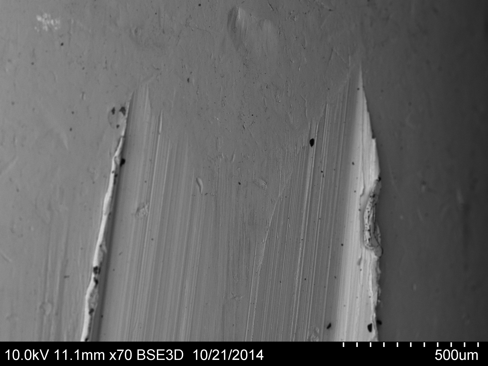
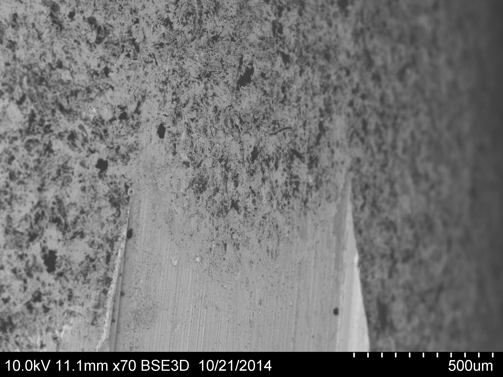

# Objective
Improve the accuracy of 300BLK subsonic ammunition.

The standard subsonic 300BLK load exhibits significant variation in muzzle velocity, which results in [excessive vertical dispersion](http://www.300blktalk.com/forum/viewtopic.php?f=140&t=86927).

We will test various products and hypotheses to determine whether improving internal ballistics can statistically increase the precision of subsonic 300BLK.

# Background
The objective of subsonic ammunition is to avoid the sonic crack that occurs as bullet velocities approach the speed of sound, which is typically about 1100fps.  Given this upper bound on velocity the only way to improve external and terminal ballistics is to increase the mass of the projectile.  The upper limit on mass of standard .30" jacketed lead-core bullets that fit the AR-15 platform with a standard bolt and magazine is 225gr, which in the BTHP profile is a bullet 1.57" long, with a bearing length of 0.70-0.75".

The standard Remington factory subsonic load, designed to cycle reliably in the greatest variety of guns, consists of:

- 220gr BTHP bullet
- 10.4gr A1680
- 2.12" COAL
QuickLOAD estimates that this generates MAP of 33kpsi and only 81% propellant burnt within a 16" barrel.

# Hypotheses

1. Reducing friction between the bullet and bore should reduce the variation of muzzle velocity.
1. Increasing peak muzzle pressure and/or burning efficiency should reduce the variation of interior ballistics, and therefore also reduce variation of muzzle velocity.

## Pressure and Accuracy
The standard subsonic 300BLK load puts a bullet optimized for supersonic flight down a bore at little more than half the peak pressure for which modern ballistic components are designed.  This may result in higher interior ballistic variances, which would also result in higher muzzle velocity variance.

We will test loads that produce higher peak pressures than the standard 33kpsi and higher interior burn ratios than the standard 80% through a 16" barrel.

We will also test Lapua's 200gr subsonic bullets.  These have a reduced bearing surface, which should reduce bore friction and any variance associated with that.  They also have a profile optimized for subsonic flight, which may improve the exterior ballistic precision.

## Friction
Variables:

1. Bullet coating
1. Barrel alloy
1. Barrel condition
1. [Bore/rifling dimensions?](300blk-test.md#bore-cross-section-correlation-to-friction)

hBN has a lower coefficient of friction and higher stability than established but messier friction-proofing compounds like MoS2 ("moly") or WS2 ("Danzac").  However it is unclear whether common uses of hBN actually reduce friction.  In general we expect reduced bore friction to result in markedly lower muzzle velocities — a well-known phenomenon with MoS2.  But no hBN users consulted to date have observed significantly reduced muzzle velocities.  Rather, the most frequently cited benefit of the proper use of hBN is reduced bore fouling.  Experts like David Tubb and [Swiss Products](http://theswissriflesdotcommessageboard.yuku.com/topic/9031/hBN-again-and-this-time-Ill-leave-it#.U6BsPPldXEV) claim that shooting only hBN-plated bullets and bores result in bores that can be cleaned with a single dry patch.  The fact that copper is not being deposited on the bore does sound consistent with reduced friction.  But our final objective is to reduce muzzle velocity variance; if a friction-proofed system fails to achieve this then we have not met our objective.

Here we will test four variations of hBN:

1. Tubb et. al. advocate impact-plating bullets with HCPL-grade hBN, which averages 10 microns and is among the most lubricious formulations.  For our tests we use a vibratory tumbler and steel shot to produce what we will call ***plated bullets***.
1. Tubb et. al. also advocate coating a completely clean bore with sub-micron hBN (we use AC6111-grade) suspended in isopropyl alcohol, and then firing a plated bullet through it to fix the hBN.  We refer to this as a ***coated bore***.
1. [Rydol](http://rydol.com/) addresses a common concern with plated bullets which is that the impact-plating process results in a non-uniform and potentially excessive build-up of hBN.  Rydol advocates bullet lubrication via ultrasonic embedment of sub-micron hBN and PTFE.  We will test bullets treated by their method as ***Polysonic bullets***.
1. Rydol also sells a bore conditioner designed to embed sub-micron hBN and PTFE particles in bore irregularities, creating a smoother and more lubricious surface.  We will test this as a ***Rydol bore***.

The consensus is that hBN is easily stripped from both *coated* and *Rydol* bores by most cleaning chemicals.  Therefore we will be able to "reset" test barrels when necessary via regular cleaning.

We already performed one test of plated bullets: [We compared 50 rounds handloaded with the standard specifications to 50 rounds using the same specifications but with hBN-plated bullets](http://www.300blktalk.com/forum/viewtopic.php?p=817836#p817836).  From a 16" stainless barrel there was no significant difference in muzzle velocity variance between the plated and unplated bullets:

- Uncoated average = 923fps, stdev = 25fps
- hBN coated average = 941fps, stdev = 27fps

Subsequently we have found suggestions that hBN does not embed or interact with stainless steel as effectively as it does with other standard barrel alloys.  Therefore this test will be repeated with 4140 chrome-moly nitride barrels.

While studying [the barrels assembled for this test](300blk-test.md#guns) we found one more potential variable: the bore and rifling dimensions.  Although all three use 5-land rifling the lands on the Noveske barrel are far wider than on the AAC barrel.  *We need to slug the barrels and determine whether cross section varies enough to explain variations in friction.*  See [300BLK Test](300blk-test.md#bore-cross-section-correlation-to-friction) in Ancillary Tests and Questions below.

### Pre-test on hBN coating
After running a vibratory coating cycle for 3 hours in airtight containers I noticed a significant ammonia odor on opening them.  Subsequent testing confirmed the presence of substantial ammonia, which suggests contamination and/or chemical degradation of the hBN.  After consulting with an engineer at Momentive Performance Materials, the source of the hBN, they agreed to analyze my samples to try to determine what's going wrong.  Their current theory is that the mechanical action of the impact-plating with steel media is causing a degradation of the hBN.  But in order to rule out contamination they are sending a new batch of HCPL-grade hBN.  I will conduct controlled tests with different media and different run-times, as well as peak temperatures during operation, to see if there is any relationship to ammonia production.

# Test outline

Our objective is to look for statistically significant improvements over the standard load and untreated barrels in terms of:

1. Reduced variation of muzzle velocity.
1. Reduced mean radius (i.e., increased on-target precision).
1. Reduced velocities or bore temperatures as evidence that any variable has reduced bullet-bore friction.

Therefore we will run the following test strings:

## Friction Sequence
Using standard load:

Load Batch #0:

1. 16" bbl:
    1. Normal bullet x50: μ = 923fps; σ = 25fps.  MR = 1.37MOA, 90% = (1.23, 1.56)
    1. Plated bullet x50: μ = 941fps; σ = 27fps.  MR = 1.46MOA, 90% = (1.30, 1.65)

Load Batch #1: This was loaded with 13.4gr A1680

1. 16" bbl:
    1. Normal bullet x20: μ = 1286fps; σ = 16fps.  MR = 1.75MOA, 90% = (1.46, 2.19)
    1. Polysonic bullet x30: μ = 1231fps; σ = 24fps.  MR = 1.06MOA, 90% = (.92, 1.26)
1. 12" coated bbl
    1. Plated bullet x40: μ = 1264fps; σ = 22fps.  MR = 2.33MOA, 90% = (1.96, 2.87)
1. 12" clean bbl:
    1. Normal bullet x20: μ = 1250fps; σ = 20fps.  MR = 1.85MOA, 90% = (1.56, 2.29)
    1. Polysonic bullet x30: μ = 1230fps; σ = 21fps.  MR = 1.55MOA, 90% = (1.35, 1.83)
1. 12" Rydol bbl:
    1. Normal bullet x30: μ = 1274fps; σ = 17fps.  MR = 1.50MOA, 90% = (1.30, 1.77)
    1. Polysonic bullet x30: μ = 1260fps; σ = 26fps.  MR = 1.11MOA, 90% = (0.97, 1.32)

Load Batch #2:

1. 12" clean bbl
    1. Normal bullet x25: μ = 929fps; σ = 16fps.
    1. B-coated bullet x25: μ = 901fps; σ = 33fps.
1. 16" clean bbl
    1. B-coated bullet x25: μ = 954fps; σ = 24fps (17fps excluding first two as "foulers").
    1. Normal bullet x25: μ = 981fps; σ = 24fps.
1. Clean and B-coat 12" bbl
    1. Normal bullet x25: μ = 948fps; σ = 26fps.
    1. B-coated bullet x25: μ = 935fps; σ = 22fps.
1. Clean and B-coat 16" bbl
    1. B-coated bullet x25: μ = 984fps; σ = 25fps
    1. Normal bullet x25: μ = 1010fps; σ = 21fps

## Pressure/Accuracy Sequence
Note that bullets are seated to max magazine length to minimize jump to lands.

1. 220gr load with MAP > 45kpsi and > 99% interior burn: 10.1gr VV N110, 2.20" COAL.
    1. 16" clean bbl
    1. # Unsuppressed x20: μ = 1147fps; σ = 12fps.  MR = 0.84MOA, 90% = (0.71, 1.04)
    1. # Suppressed x20: μ = 1151fps; σ = 11fps.  MR = 0.62MOA, 90% = (0.52, 0.78)
    1. 12" Rydol bbl
    1. # Unsuppressed x10 (fails to cycle): μ = 1166fps; σ = 15fps.
    1. # Suppressed x20: μ = 1170fps; σ = 13fps.  MR = 0.70MOA, 90% = (0.59, 0.86)
1. 200gr Lapua .308" load with MAP > 45kpsi and > 99% interior burn: 10.2gr VV N110, 2.10" COAL.
    1. 16" clean bbl
    1. # Unsuppressed x20: μ = 1170fps; σ = 11fps.  MR = 0.86MOA, 90% = (0.72, 1.06)
    1. # Suppressed x20: μ = 1203fps; σ = 12fps.  MR = 0.79MOA, 90% = (0.67, 0.98)
    1. 12" Rydol bbl with suppressor x20: μ = 1218fps; σ = 19fps.  MR = 1.11MOA, 90% = (0.94, 1.37)

# Equipment

## Guns
All guns have pistol-length gas systems and will run the same NP3-coated BCG.

All barrels have 5-land rifling (*TBD: rifling method and cross section via slugging*):

1. Noveske 16" 1:7 stainless.  Chambers 220gr SMKs up to 2.27" COAL and 200gr Lapua subsonics up to 2.14" COAL.
1. AAC 12.5" 1:7 4140 chorme-moly nitride.  Chambers 220gr SMKs up to 2.31" COAL. [Muzzle photo](http://i.stack.imgur.com/xFGC3.jpg)
1. CMMG 8" 1:7 4140 chorme-moly nitride.  Chambers 220gr SMKs up to 2.27" COAL and 200gr Lapua subsonics up to 2.14" COAL.

## Loads
All cases are fired Remington 300BLK brass.  Cases are full-length sized, then case mouth is chamferred, deburred, brushed; then primer pocket is cleaned.

Primers are Remington #7.5.

Powder is dispensed by volume after calibration.  Bullets in a subsequence are alternated so that any drift in powder dispenser is evenly distributed between the strings.

A single lot of A1680 and VV N110 will be used for all loads.

Bullets are seated with a Forster Benchrest Seater die.

524 Bullets required:
- 185 220gr SMKs
- 93 Polysonic coated 220gr SMKs
- 82 Plated 220gr SMKs
- 82 Lapua 200gr .308"
- 82 Lapua 200gr .310"

## Measurements
Two chronographs will be positioned in line starting 15 feet from muzzle.

1. [Competition Electronics ProChono Digital](https://www.competitionelectronics.com/index.php?page=shop.product_details&flypage=flypage.tpl&product_id=20&category_id=7&vmcchk=1&option=com_virtuemart&Itemid=79)
1. [Caldwell Ballistic Precision Chronograph](http://www.btibrands.com/product/ballistic-precision-chronograph/)

Thermocouple to check barrel temperature secured with electrical tape to top of barrel 2.5" forward of gas block.

# Procedures
All guns will be shot without suppressors, [which increase dispersion of muzzle velocity](http://david.bookstaber.com/Interests/2007/03/freebore-boost-effects/).

Muzzles will be shot with bare threads, to avoid the risk that thread protectors or any other device might loosen or affect harmonics.

One sample of every bullet/bore condition will be fired into a water tank so bullet engraving can be examined.

Test firing shall be at 100-yard targets from a shaded bunker.  If accuracy fixture is operational at time of test guns will be locked in fixture for firing.  Otherwise firing will be from sandbags with a benchrest scope in LaRue QD mount.  Trigger is Timney 3.5# single-stage.

Every attempt will be made to avoid firing when wind gusts appear to exceed 5mph.

Every sample string will start with a cold bore and we will attempt to fire them at the same rate so that the final barrel temperatures can be fairly compared.

# Data
For each string:

1. Load
1. Upper
1. Bore condition

## Temperature

1. String
1. Start time, barrel temp, and ambient temp & humidity
1. End time, barrel temp, and ambient temp & humidity

## Chronograph

1. String
1. Shot #
1. Chronograph #1 FPS
1. Chronograph #2 FPS

## Precision

1. String
1. Mean Radius with 90% confidence interval

## Failures
Failures to feed, fire or cycle will be noted but corrected as quickly as possible to avoid interrupting the string.

# Ancillary Tests and Questions

## Atomic Analysis
Fired and unfired samples of bullets, both coated and uncoated, were sent to an imaging specialist with access to scanning electron and atomic force microscopes, as well as energy-dispersive x-ray (EDX) equipment.  We hope to see:

- What are the coefficients of friction on the bearing surfaces of the three unloaded rounds?
- Can you determine how thick and uniform the hBN coating is?  If so,
- Can you determine how much, if any, hBN survives the firing process – especially in the engraved portions of the bullets where the friction is most substantial?

## Bore Cross-section Correlation to Friction
*Does the bore cross-section vary enough between barrels to affect bullet friction?*

The bore cross-section is specified by SAAMI, but that dimension is often only loosely referenced by machinists.

Therefore we will carefully slug the barrels to see if we can detect variations in cross-section.  If that is insufficiently precise we will measure the bore volume (using water-soluble cutting fluid).

# Conclusions

Our objective was to increase the precision of subsonic 300BLK rifles by looking at modifications to the ammunition, with a special emphasis on trying to reduce the variance of muzzle velocity.

Neither bullet coatings nor barrel coatings could significantly reduce the variance of muzzle velocity using A1680 powder.  However two of the three bullet coatings tested *did* show evidence of friction-proofing.

1. **Bullet Coatings:**
    1. hBN impact-plated bullets always resulted in wider groups, higher muzzle velocities, and no improvement in the variance of velocity.
    1. Rydol Polysonic-treated bullets always resulted in significantly tighter groups and slightly lower muzzle velocities than the same load with regular untreated bullets.
    1. Company *B* coated bullets always resulted in lower muzzle velocities (about 2.5% lower), indicating consistent friction proofing.
1. **Barrel Coatings:**
    1. Test strings 1.3 and 1.4 show that the Rydol conditioned bore produced higher muzzle velocities than the control (i.e., clean bore before treatment) -- about 2.4% higher.  In general I do not find this to be a good thing, since it's the opposite of what good lubrication is supposed to do.  However, the ultimate objective here was to look at tightening groups, and it does appear to have delivered on that front: In fact, I show better than 90% confidence that the Polysonic bullets were more precise in the coated bore than the uncoated.
    1. Test strings 2.3 and 2.4 show that the Company *B* conditioned bores also produced higher muzzle velocities -- almost 3% higher than the controls.  However I may have applied too thick a coating, constricting the bore cross-section and thereby producing the higher pressures indicated by the velocity increase.  This test was run at lower velocities than the first, making it impractical to gauge relative precision at 100 yards.  I did note that absolutely no copper fouling was evident in the coated bores after the test, so the coating is performing its intended function.
1. **Loads:** I suspected that the MAP (about 33kpsi) and incomplete interior burn of the standard load is a significant contributor to the high standard deviation of muzzle velocity – above 20fps – observed in all tests using that load.  I tested a load using VV N110, which QuickLOAD estimates achieves MAP of 45kpsi and almost complete interior burn.  While marginally supersonic (1150fps) and unable to cycle the AAC upper without a suppressor, this **did appear to validate the theory since in every test standard deviation of muzzle velocity was about 12fps, and groups were better than half the mean radius of the control groups!**

Therefore, if you want to produce ammunition that should give better accuracy in *every* gun I would have Rydol treat the bullets.  Company *B*'s bullet coating is probably more expensive but also more reliable in its effect.

I would also spend more time looking for more efficient loads with higher MAPs.  If you can’t do this without compromising compatibility I would produce “special-purpose” ammunition that is advertised as having higher accuracy, but that may require a suppressor or wider gas port to cycle reliably.

One other observation concerns barrels: The 12” 4140 barrel had a leade that was about .04” longer than the leade in the 16” stainless barrel.  The stainless barrel was always more accurate, and I suspect the reduced bullet jump was a significant contributor to that accuracy. 

## hBN plating

<figure class="figure-left" style="max-width: 320px" markdown="span">
  
  <figcaption markdown="span">Micrograph of the beginning of rifled groove engraved on a .30" copper-jacketed bullet.</figcaption>
</figure>
 

<figure class="figure-right" style="max-width: 320px" markdown="span">
  
  <figcaption markdown="span">Micrograph of rifled engraving on a .30" copper-jacketed bullet that was impact-plated with hBN (which appears in black).</figcaption>
</figure>

Testing the impact-plated bullets in both stainless and 4140 barrels, coated or uncoated, shows the bullet coating actually *adversely impacts performance*: **muzzle velocity is slightly higher, velocity dispersion is the same, and accuracy on target is reduced**!  Electron micrographs of a plated bullet show that absolutely no hBN is left in the bullet grooves, suggesting it is scraped away by the rifling during engraving.  Which means that all the impact plating process is doing is dinging up the bullets on a microscopic level and leaving (as the imaging technician described it) puddles of hBN in the resulting jacket scars.

A number of variations were attempted on impact plating, including adding heat, varying run-time, and varying media.  None created any notable difference.  I even sent a batch to WMD to attempt spin-coating.  On their own initiative they even bead-blasted some bullets to try to get the hBN to adhere better and they concluded it would not.  Even with a batch of HCPL hBN direct from the manufacturer degradation into ammonia always resulted from aggressive and/or extended run times.  I’m convinced impact-plating hBN is a dead end.

## Polysonic coating
Show reduced muzzle velocity, which is the surest sign of friction proofing I know.  Specifically, in a 12" barrel I measured muzzle velocity falling from 1250fps to 1230fps, and in a 16" barrel it falls from 1286fps to 1231fps.  (The fact that we measure the same muzzle velocity out of two barrels with a length difference of 4" is not surprising: Remember this cartridge is intentionally loaded with a fast powder that doesn't exploit barrel length to build velocity, and also that the rifling and composition of the two barrels are different.)

The tests involved shooting 20 rounds of the untreated "control" bullets followed by 30 rounds of Polysonic bullets, in each barrel.

Polysonic bullets also show statistically significant increases in accuracy on target vs regular bullets.  From the 16" barrel the target statistics show Polysonic to be more accurate at the 98% confidence level!

## Rydol bore coating
The tests show this coating produces a further increase in precision, but it's unclear to me why that would happen when muzzle velocities are increasing.

Unfortunately I don't have a good protocol to measure the other benefits Rydol should provide, like reduced fouling and easier cleaning.

It's also possible I didn't properly condition the barrel, so there's a potential user/tester error on this product that doesn't exist with the factory-coated Polysonic bullets.

During this test I was only able to evaluate this product on one "virgin barrel."  Ideally I would do a much more extended test involving multiple barrels as well as a full-rifle caliber (e.g., .223 or .308) to better understand the performance of the bore conditioner.
