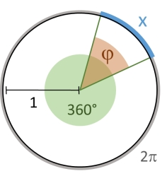
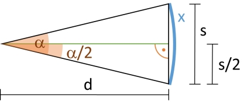
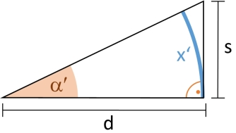
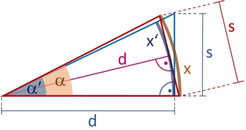

# Conversion between absolute and angular size units

<figure class="figure-right" style="max-width: 236px" markdown="span">
  
  <figcaption markdown="span">Angle $\varphi$ (degree) with corresponding arc length $x$ (radian) in the unit circle.</figcaption>
</figure>

As mentioned in [Describing Precision](describing-precision.md), group size is often measured in terms of its angular diameter in addition to reporting absolute length. Angles can be measured equivalently either in degree or in radian. If $x$ is the angular measurement in radian, and $\varphi$ the angular measurement in degree for the same angle, then $\frac{x}{2 \pi} = \frac{\varphi}{360}$ such that conversion between degree and radian is given by $x = \frac{2 \pi}{360} \cdot \varphi$ and $\varphi = \frac{360}{2 \pi} \cdot x$.

The angular size of an object with absolute size $s$ is its angular diameter at a given distance $d$. This is the angle $\alpha$ subtended by the object with the line of sight centered on it. The following sections show how to convert between absolute size and these common units for angular size:

- MOA = minute of angle = minute of arc = arcmin. The circle is divided into 360 degrees, 1 MOA = 1/60 degree, such that the circle has $360 \cdot 60 = 21600$ MOA.
- SMOA = Shooter's MOA = Inches Per Hundred Yards IPHY. 1 inch at 100 yards = 1 SMOA.
- mrad = milliradian = 1/1000 radian. 1 radian is 1 unit of arc length on the unit circle which has a circumference of $2 \pi$. The circle is thus divided into $2 \pi \cdot 1000 \approx 6283.19$ mrad.
- mil (NATO definition). The unit circle circumference of $2 \pi$ is divided into 6400 mils.

The [shotGroups web app](http://shiny.imbei.uni-mainz.de:3838/shotGroups_AngularSize/) provides an interactive online tool to convert between absolute and angular size units.

 
## Calculating the angular diameter of an object

<figure class="figure-right" style="max-width: 417px" markdown="span">
  
  <figcaption markdown="span">Angular diameter of object with absolute size $s$ at distance to target $d$. Right triangle formed by $d$ and object of size $s/2$. $s$ corresponds to angle $\alpha$ (degree) and arc length $x$ (radian).</figcaption>
</figure>

The angle $\alpha$ subtended by an object of size $s$ at distance $d$ can be calculated from the right triangle with hypotenuse of length $d$ and cathetus of length $s/2$ as $\tan\left(\frac{\alpha}{2}\right) = \frac{s}{2} \cdot \frac{1}{d}$, therefore $\alpha = 2 \cdot \arctan\left(\frac{s}{2 d}\right)$.

Assuming that the result from functions $\tan(\cdot)$ and $\arctan(\cdot)$ is in radian, and that distance to target $d$ and object size $s$ are measured in the same unit, this leads to the following **formulas for calculating $\alpha$ and $x$ in mrad or mil based on $d$ and $s$**:

- Angle $\alpha$ in MOA: $\alpha = 60 \cdot \frac{360}{2 \pi} \cdot 2 \cdot \arctan\left(\frac{s}{2 d}\right) = \frac{21600}{\pi} \cdot \arctan\left(\frac{s}{2 d}\right)$
- Angle $\alpha$ in SMOA: By definition, size $s=1$ inch at $d=100$ yards ($= 3600$ inch) is 1 SMOA. Conversion factors to/from MOA are $\frac{21600}{\pi} \cdot \arctan\left(\frac{1}{2 \cdot 3600}\right) \approx 0.95493$ (fairly close to $3/\pi$), and $\frac{\pi}{21600} \cdot \frac{1}{\arctan(1/7200)} \approx 1.04720$ (fairly close to $\pi/3$). Therefore: $\alpha = \frac{\pi}{21600} \cdot \frac{1}{\arctan(1/7200)} \cdot \frac{21600}{\pi} \cdot \arctan\left(\frac{s}{2 d}\right) = \frac{1}{\arctan(1/7200)} \cdot \arctan\left(\frac{s}{2 d}\right)$
- Arc length $x$ in mrad: $x = 2000 \cdot \arctan\left(\frac{s}{2 d}\right)$
- Arc length $x$ in NATO mil: $x = \frac{6400}{\pi} \cdot \arctan\left(\frac{s}{2 d}\right)$

(Conversion from MOA to mrad is $\frac{21600}{2000 \pi} \approx 3.43775$.  Conversion from mrad to MOA is $\frac{2000 \pi}{21600} \approx 0.29089$. Conversion from MOA to mil is $\frac{21600}{6400} = 3.375$. Conversion from mil to MOA is $\frac{6400}{21600} \approx 0.2962963$.)

We can also give **formulas for absolute object size $s$ given angle $\alpha$ and distance to target $d$**:

- From angle $\alpha$ in MOA: $s = 2 \cdot d \cdot \tan\left( \frac{(2 \pi/360) (\alpha / 60)}{2} \right) = 2 \cdot d \cdot \tan\left(\alpha \cdot \frac{\pi}{21600}\right)$
- From angle $\alpha$ in SMOA: $s = \frac{21600}{\pi} \cdot \arctan\left(\frac{1}{7200}\right) \cdot 2 \cdot d \cdot \tan\left(\alpha \cdot \frac{\pi}{21600}\right)$
- From arc length $x$ in mrad: $s = 2 \cdot d \cdot \tan(x / 2000)$
- From arc length $x$ in NATO mil: $s = 2 \cdot d \cdot \tan\left(x \cdot \frac{\pi}{6400}\right)$

Similarly, we obtain the following **formulas for distance to target $d$ given absolute object size $s$ and angle $\alpha$**:

- From angle $\alpha$ in MOA: $d = \frac{s}{2} \cdot \frac{1}{\tan(\alpha \cdot \pi/21600)}$
- From angle $\alpha$ in SMOA: $d = \frac{s}{2} \cdot \frac{1}{\tan(\alpha \cdot \arctan(1/7200))}$
- From arc length $x$ in mrad: $d = \frac{s}{2} \cdot \frac{1}{\tan(x / 2000)}$
- From arc length $x$ in NATO mil: $d = \frac{s}{2} \cdot \frac{1}{\tan(x \cdot \pi/6400)}$

## Less accurate calculation of angular size

<figure class="figure-left" style="max-width: 334px" markdown="span">
  
  <figcaption markdown="span">Object "sits" on line of sight: right triangle formed by distance to target $d$ and object of size $s$. $s$ corresponds to angle $\alpha'$ (degree) and arc length $x'$ (radian).</figcaption>
</figure>

<figure class="figure-right" style="max-width: 410px" markdown="span">
  
  <figcaption markdown="span">Comparison between actual angular diameter $\alpha$ (red) and the approximate angular size $\alpha'$ (blue) as well as between arc lengths $x$ (red) and $x'$ (blue) corresponding to $s$ at distance $d$.</figcaption>
</figure>

Sometimes, a slightly different angular size is reported as corresponding to absolute size $s$ at distance $d$: This is the angle $\alpha'$ subtended by the object if it "sits" on the line of sight. $\alpha'$ can be calculated from the right triangle with hypotenuse of length $d$ and cathetus of length $s$, so $\tan(\alpha') = \frac{s}{d}$, therefore $\alpha' = \arctan(\frac{s}{d})$.

If size $s$ is small compared to distance $d$, the difference between the actual angular diameter $\alpha$ and the approximate angular size $\alpha'$ is negligible, but it becomes noticeable once $s$ gets bigger in relation to $d$.
