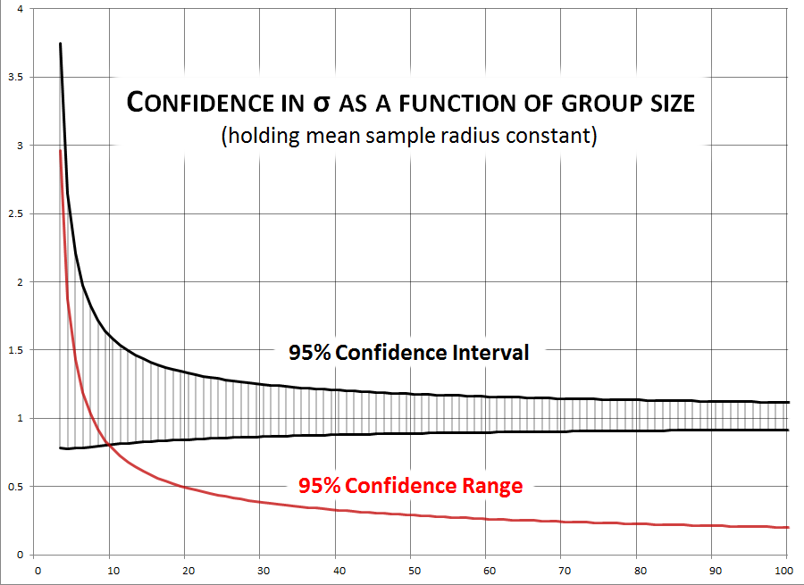
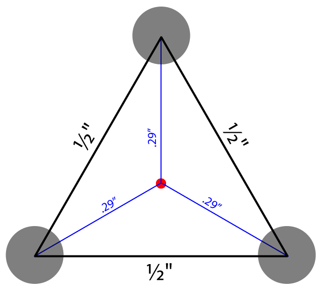

# Symmetric Bivariate Normal Shots Imply Rayleigh Distributed Distances

{ .figure-caption }
*Distribution of samples from a symmetric bivariate normal distribution.  Axis units are multiples of σ.*

After factoring out the known sources of asymmetry in the bivariate normal model we might conclude that shot groups are sufficiently symmetric that we can assume $\sigma_x = \sigma_y$.  In the case of the symmetric bivariate normal distribution, the distance of each shot from the center of impact (COI) follows the Rayleigh distribution with parameter *σ*.[^1]

NB: It is common to describe normal distributions using variance, or $\sigma^2$, because variances have some convenient linear characteristics that are lost when we take the square root.  For similar reasons many prefer to describe the Rayleigh distribution using a parameter $\gamma = \sigma^2$.  To clarify our parameterization **the *σ* we will be describing is the standard deviation of the bivariate normal distribution, and the parameter that produces the following pdf for the Rayleigh distribution**:

$$
\frac{x}{\sigma^2}e^{-x^2/2\sigma^2}
$$

Where the bivariate normal distribution describes the coordinates (*x*, *y*) of shots on target, the Rayleigh distribution describes the distance, or radius, $r_i = \sqrt{(x_i - \bar{x})^2 + (y_i - \bar{y})^2}$ of those shots from the center point of impact.

# Estimating *σ*
The Rayleigh distribution provides closed form expressions for precision.  However, when estimating *σ* from sample sets we will most often use methods associated with the normal distribution for one essential reason: *We never observe the true center of the distribution*.  When we calculate the center of a group on a target it will almost certainly be some distance from the true center, and thus underestimate the true distance of the sample shots to the distribution center.  (Average distance from sample center to true center is listed in the second column of [Sigma1ShotStatistics.ods](media/Sigma1ShotStatistics.ods).)  The Rayleigh model describes the distribution of shots from the (unobservable) true center.  When the center is unknown we have to use the sample center, and we fall back on characteristics of the normal distribution with unknown mean.

## Correction Factors
The following three correction factors will be used in many estimation formulas.

Note that all of these correction factors are > 1, are significant for very small *n*, and converge towards 1 as $n \to \infty$.  Their values are listed for *n* up to 100 in [Sigma1ShotStatistics.ods](media/Sigma1ShotStatistics.ods).  [SymmetricBivariate.c](media/SymmetricBivariate.c) uses Monte Carlo simulation to confirm that their application produces valid corrected estimates.

### [Bessel correction factor](http://en.wikipedia.org/wiki/Bessel%27s_correction)
The Bessel correction removes bias in sample variance.

$$
c_{B}(n) = \frac{n}{n-1}
$$

### [Gaussian correction factor](http://en.wikipedia.org/wiki/Unbiased_estimation_of_standard_deviation#Results_for_the_normal_distribution)
The Gaussian correction (sometimes called $c_4$) removes bias introduced by taking the square root of variance.

$$
\frac{1}{c_{G}(n)} \equiv c_4 = \sqrt{\frac{2}{n-1}}\,\frac{\Gamma\left(\frac{n}{2}\right)}{\Gamma\left(\frac{n-1}{2}\right)} \, = \, 1 - \frac{1}{4n} - \frac{7}{32n^2} - \frac{19}{128n^3} + O(n^{-4})
$$

The third-order approximation is adequate.  The following spreadsheet formula gives a more direct calculation:  $c_{G}(n)$ `=EXP(GAMMALN((N-1)/2) - LN(SQRT(2/(N-1))) - GAMMALN(N/2))`

### Rayleigh correction factor
The unbiased estimator for the Rayleigh distribution is also for $\sigma^2$.  The following[^2] corrects for the concavity introduced by taking the square root to get *σ*.

$$
c_{R}(n) = \frac {\Gamma(N)\sqrt{N}} {\Gamma\left(N + \frac 1 2\right)} =c_G(2n+1)
$$

To avoid overflows this is better calculated using log-gammas, as in the following spreadsheet formula: `=EXP(LN(SQRT(N)) + GAMMALN(N) - GAMMALN(N+1/2))`

## Data
In the following formulas assume that we are looking at a target reflecting *n* shots and that we are able to determine the center coordinates *x* and *y* for each shot.

(One easy way to compile these data is to process an image of the target through a program like [OnTarget Precision Calculator](http://ontargetshooting.com/features.html).)

## Variance Estimates
For a single axis the [unbiased estimate of variance](http://en.wikipedia.org/wiki/Bessel's_correction#Formula) for a normal distribution is $s_x^2 = \frac{\sum (x_i - \bar{x})^2}{n-1}$, from which the unbiased estimate of standard deviation is $\widehat{\sigma_x} = c_G(n) \sqrt{(s_x^2)}$.

Since we are assuming that the shot dispersion is jointly independent and identically distributed along the *x* and *y* axes we improve our estimate by aggregating the data from both dimensions.  I.e., we look at the average sample variance $s^2 = (s_x^2 + s_y^2)/2$, and $\hat{\sigma} = c_G(2n-1) \sqrt{s^2}$.  This turns out to be identical to the Rayleigh estimator.

## Rayleigh Estimates
The Rayleigh distribution describes the random variable *R* defined as the distance of each shot from the center of the distribution.  Again, we never get to observe the true center, so we begin by calculating the sample center $(\bar{x}, \bar{y})$.  Then for each shot we can compute the sample radius $r_i = \sqrt{(x_i - \bar{x})^2 + (y_i - \bar{y})^2}$.

The [unbiased Rayleigh estimator](http://en.wikipedia.org/wiki/Rayleigh_distribution#Parameter_estimation) is $\widehat{\sigma_R^2} = c_B(n) \frac{\sum r_i^2}{2n} = \frac{c_B(n)}{2} \overline{r^2}$, which is literally a restatement of the combined variance estimate $s^2$.  Hence the unbiased parameter estimate is once again $\hat{\sigma} = c_G(2n-1) \sqrt{\widehat{\sigma_R^2}}$.

[Rayleigh sigma estimate](rayleigh-sigma-estimate.md) provides a derivation of this formula.

### Multiple Groups

In general we give up two degrees of freedom for every group center we estimate.  So if we are aggregating results from *g* sample groups then:

$$
\hat{\sigma} = c_G(2n+1-2g) \sqrt{\frac{\sum r_i^2}{2n-2g}}
$$

[When the true center is known](rayleigh-sigma-estimate.md#known-true-center) then this formula is correct with *g* = 0.

## Confidence Intervals
Siddiqui[^3] shows that the confidence intervals are given by the $\chi^2$ distribution with 2*n* degrees of freedom.  However this assumes we know the true center of the distribution.  We lose two degrees of freedom (one in each dimension) by using the sample center, so we actually have only 2(*n* - *g*) degrees of freedom.  (Here again we will get the same equations if we instead follow the derivation of confidence intervals for the combined variance $s^2$.)

To find the (1 - *α*) confidence interval, first find $\chi_L^2, \ \chi_U^2$ where:

$$
Pr(\chi^2(2(n-g)) \leq \chi_L^2) = \alpha/2, \quad Pr(\chi^2(2(n-g)) \leq \chi_U^2) = 1 - \alpha/2
$$

For example, using spreadsheet functions we have $\chi_L^2$ = `CHIINV(α/2, 2(n-g))`,$\quad \chi_U^2$ = `CHIINV((1-α/2), 2(n-g))`.

Now the confidence intervals are given by the following:
$s^2 \in \left[ \frac{2(n-1) s^2}{\chi_L^2}, \ \frac{2(n-1) s^2}{\chi_U^2} \right]$, or in equivalent Rayleigh terms $\widehat{\sigma_R^2} \in \left[ \frac{\sum r^2}{\chi_L^2}, \ \frac{\sum r^2}{\chi_U^2} \right]$

Since convexity in the numerator and denominator cancel out, no correction factors are needed to compute the confidence interval on the Rayleigh parameter itself:

$$
\widehat{\sigma} \in \left[ \sqrt{\frac{\sum r^2}{\chi_L^2}},  \ \sqrt{\frac{\sum r^2}{\chi_U^2}} \right]
$$

Note that for large *n* the median of this $\chi^2$ distribution is very close to the MLE: $\widehat{\sigma} \approx \sqrt{\frac{\sum r^2}{\chi_{50\%}^2}}$

### How large a sample do we need?

Confidence intervals are a function of both the sample size and the sample sigma.  The adjacent chart shows the 95% confidence intervals in terms of the estimated σ so we can see how the interval tightens as sample size increases.

With a sample of 10 shots our 95% confidence interval is 77% as large as the parameter σ itself.  At 20 it's just under 50%.  It takes a group of 66 shots to get it under 25% and 100 to get it to 20% of the estimated σ.

 

### The 3-shot Group

{ .figure-caption }
*Sample 3-shot group with 1/2" extreme spread. Sample center is in red. Each shot has *r* = .29".*

A rifle builder sends you a [3-shot group](faq.md#how-meaningful-is-a-3-shot-precision-guarantee) measuring ½" between each of three centers to prove how accurate your rifle is.  *What does that really say about the gun's accuracy?*
In the *best* case — i.e.:

1. The group was actually fired from your gun
1. The group was actually fired at the distance indicated (in this case 100 yards)
1. The group was not cherry-picked from a larger sample — e.g., the best of an unknown number of test 3-shot groups
1. The group was not clipped from a larger group (in the style of [the "Texas Sharpshooter"](http://www.ar15.com/forums/t_3_118/500913_.html))
— if all of these conditions are satisfied, then we have a statistically valid sample.  In this case our group is an equilateral triangle with ½" sides.  A little geometry shows the distance from each point to sample center is $r_i = \frac{1}{2 \sqrt{3}} \approx .29"$.

The Rayleigh estimator $\widehat{\sigma_R^2} = c_B(3) \frac{\sum r_i^2}{6} = \frac{3}{2} \frac{1}{24} = \frac{1}{16}$.  So $\hat{\sigma} = c_G(2n - 1) \sqrt{1/16} = (\frac{4}{3}\sqrt{\frac{2}{\pi}})\frac{1}{4} \approx .25MOA$.  Not bad!  But not very significant.  Let's check the confidence intervals: For *α* = 10% (i.e., 90% confidence interval)
$\chi_L^2(4) \approx 9.49, \quad \chi_U^2(4) \approx 0.711$.  Therefore,
$0.03 \approx \frac{1}{4 \chi_L^2} \leq \widehat{\sigma_R^2} \leq \frac{1}{4 \chi_U^2} \approx 0.35$, and

$$
0.16 \leq \hat{\sigma} \leq 0.59
$$

so with 90% confidence we can only say that the gun's true precision *σ* is somewhere in the range from approximately 0.2MOA to 0.6MOA.

# Using *σ*

{ .figure-caption }
*Rayleigh distribution of shots given *σ**

The *σ* we have carefully sampled and estimated is the parameter for the Rayleigh distribution with probability density function $\frac{x}{\sigma^2}e^{-x^2/2\sigma^2}$.  The associated Cumulative Distribution Function gives us the probability that a shot falls within a given radius of the center:

$$
Pr(r \leq \alpha) = 1 - e^{-\alpha^2 / 2 \sigma^2}
$$

Therefore, we expect 39% of shots to fall within a circle of radius *σ*, 86% within *2σ*, and 99% within *3σ*.

Using the characteristics of the Rayleigh distribution we can immediately compute the three most useful [precision measures](describing-precision.md#measures):

## Mean Radius (MR)
Mean Radius $MR = \sigma \sqrt{\frac{\pi}{2}} \ \approx 1.25 \ \sigma$.

$1 - e^{-\frac{\pi}{4}} \approx 54\%$ of shots should fall within the mean radius.  96% of shots should fall within the Mean Diameter (MD = 2 MR).

*Given σ*, the expected sample MR of a group of size *n* is

$$
MR_n = \sigma \sqrt{\frac{\pi}{2 c_{B}(n)}}\ = \sigma \sqrt{\frac{\pi (n - 1)}{2 n}}
$$

(This sample size adjustment doesn't use the Gaussian correction factor because the mean radius is not an estimator for *σ*, even though in the limit the true value of one is a constant multiple of the other.)

## Circular Error Probable (CEP)
For the Rayleigh distribution, the 50%-Circular Error Probable is $CEP(0.5) = \sigma \sqrt{\ln(4)} \ \approx 1.18 \ \sigma$. 50% of shots should fall within a circle with this radius around the point-of-aim. See [Circular Error Probable](circular-error-probable.md) for a more detailed discussion.

(In theory CEP is the median radius, but especially for small *n* **the sample median is a very bad estimator for the true median**.  Given *σ*, the following is a good estimate of the *expected sample median radius* of a group of size *n*:

$$
CEP_n = \sigma \frac{\sqrt{\ln(4)}}{c_{G}(n) c_{R}(n)}
$$

I.e., the observed sample median tends to be lower than the true median when *n* is small.)

## Summary Probabilities
From the Rayleigh quantile function we can compute the radius expected to cover proportion *F* of shots as $CEP(F) = \sigma \sqrt{-2 \ln(1-F)}$.  E.g.,
| Name | Multiple *x* of *σ* | Shots Covered by Circle of Radius *x σ* |
| --- | --- | --- |
|  | 1 | 39% |
| CEP | 1.18 | 50% |
| MR | 1.25 | 54% |
|  | 2 | 86% |
| R~90~ | 2.15 | 90% |
| MD | 2.5 | 96% |
|  | 3 | 99% |

## Typical values of *σ*
A lower bound on *σ* is probably that displayed by rail guns in 100-yard competition.  On average they can place 10 rounds into a quarter-inch group, which [as we will see shortly](closed-form-precision.md#using) suggests *σ* = 0.070MOA, or under 0.025mil.

The U.S. Precision Sniper Rifle specification requires a statistically significant number of 10-round groups fall under 1MOA.  This means *σ* = 0.28MOA, or under 0.1mil.

The specification for the M110 semi-automatic sniper rifle (MIL-PRF-32316) as well as the M24 sniper rifle (MIL-R-71126) requires MR below 0.65SMOA, which means *σ* = 0.5MOA.  The latter spec indicates that an M24 barrel is not considered worn out until MR exceeds 1.2MOA, or *σ* = 1MOA!

XM193 ammunition specifications require 10-round groups to fall under 2MOA.  This means *σ* = 0.6MOA or 0.2mil, and it is a good minimum precision standard for light rifles.

## How many sighter shots do you need?

{ .figure-caption }
*99% shooting errors expected from 3-shot sighting groups, which on average impact .7σ from the Point of Aim.*

How many shots do you need to zero your scope?  As detailed in [Sighter Distribution](sighter-distribution.md) we know that the distance from the true center of a "sighting group" of *n* shots has a Rayleigh distribution with parameter $\sigma / \sqrt{n}$.

[Sight Zeroing Example](sight-zeroing-example.md) shows the effect of increasing the number of shots used to check sight alignment.

Following is a table showing the mean distance of a sighting group from the true zero for groups of different sizes, in terms of *σ*.  To illustrate the implications for a typical precision gun we convert this to inches of error at 100 yards for a *σ* = 0.5MOA gun.

| Sighter |  |  |  |  |
| --- | --- | --- | --- | --- |
| 3 | 0.7 *σ* | 0.4" | 8% | 4% |
| 5 | 0.6 *σ* | 0.3" | 5% | 2% |
| 10 | 0.4 *σ* | 0.2" | 3% | 1% |
| 20 | 0.3 *σ* | 0.15" | 1% | <1% |

The [Rice distribution](http://en.wikipedia.org/wiki/Rice_distribution) gives the expected hit probabilities when incorporating a sighting error *ε σ*.  The Rice CDF is hard to calculate so here we used [Wolfram Alpha](http://www.wolframalpha.com/) to compute CDF values as $F(x|ε, \sigma) = P(X \leq x)$ `= MarcumQ[1, ε, 0, x]`, which gives the probability of a hit within distance *x σ* given a sighting error of *ε σ*.  (We can also use Python `scipy.stats.rice.cdf(x, ε, scale=σ)`.)

We define a ***t*% target** as a target large enough that *t*% of shots fired would be expected to hit it, if the gun were perfectly sighted in.  (This value is given by the Rayleigh distribution.)

"Shots Lost to Sighting Error" on a *t*% target is the difference between the proportion of shots that would hit if perfectly sighted and the proportion expected to hit with a sighting error of *ε*: i.e., $F(t|0, \sigma) - F(t|ε, \sigma)$.

# References

[^1]: [''Shot group statistics'', Jeroen Hogema, 2005](prior-art.md#hogema-2005-shot-group-statistics)

[^2]: [''Statistical Inference for Rayleigh Distributions'', M. M. Siddiqui, 1964, p.1007](media/Statistical%20Inference%20for%20Rayleigh%20Distributions%20-%20Siddiqui,%201964.pdf)

[^3]: [''Some Problems Connected With Rayleigh Distributions'', M. M. Siddiqui, 1961, p.169](media/Some%20Problems%20Connected%20With%20Rayleigh%20Distributions%20-%20Siddiqui%201961.pdf)
