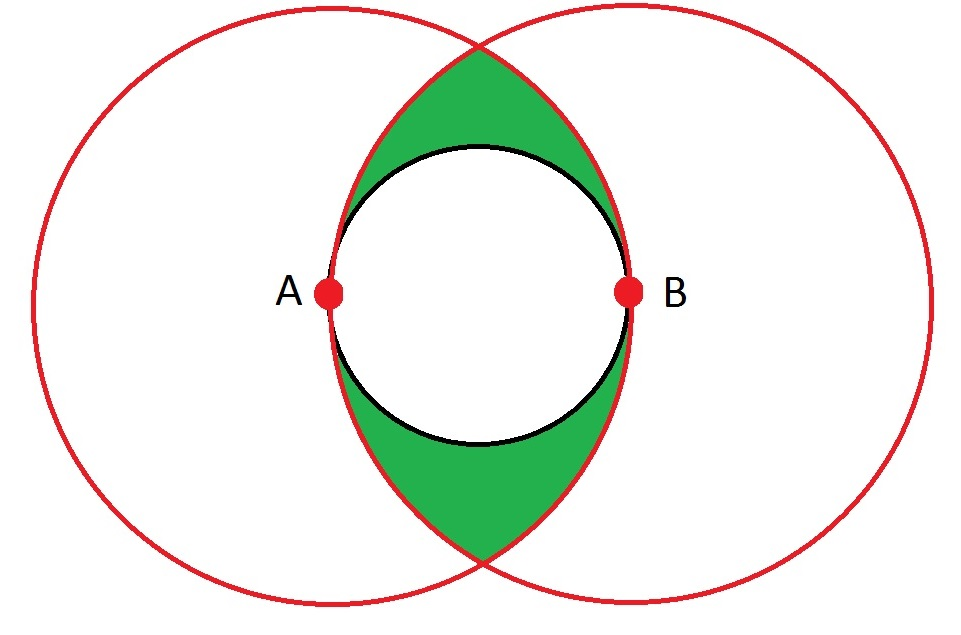

# Covering Circle Radius versus Extreme Spread

The figure to the right illustrates the difference between the Covering Circle Radius and the Extreme Spread measurements. Given that AB is the extreme spread measure, a back circle which has AB as a *diameter* has been drawn. At points A and B, red circles have been drawn with a *radius* of AB.

Thus points in the green region are:

- Outside circle that has AB as a diameter
- Closer to A than B
- Closer to B than A

So if a shot happens to fall in one of the green regions, then the covering circle radius will have to be more than 1/2 of the ES.  Of course if one shot was in the upper green zone and one shot in the lower green zone, then those two shots would be further apart than AB.
 
Consider the radius of the circle circumscribing the top green region and points A and B. Let C be the upper point where the circles about A and B intersect. Then AB = BC = AC, thus ABC forms an equilateral triangle. The circumscribing circle has an diameter of:  
 

    Diameter = $\frac{2 \sqrt{3}}{3} AB \approx 1.155 AB$

Thus:  

$$
0.577 ES \geq CCR \geq 0.5 ES
$$
