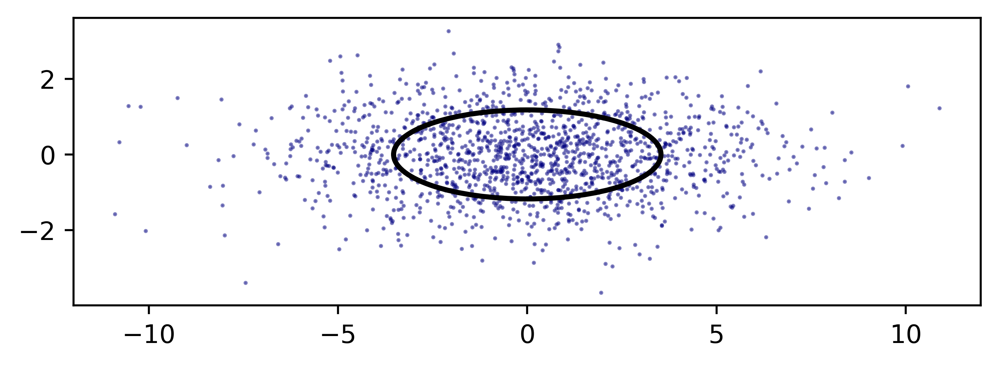

# Preserving Asymmetry
There are two significant sources of dispersion asymmetry in ballistics:

1. Crosswind variance will cause excess dispersion only in the horizontal axis.
1. Muzzle velocity variance will cause excess dispersion that appears only in the vertical axis, and which can become quite significant at longer shooting distances.

Given (*x, y*) coordinate data of impacts on a target, we can preserve asymmetry in the precision models and their application by treating each axis separately.  [As described in Closed Form Precision](closed-form-precision.md#variance-estimates), for variance in one dimension:

$$
\hat{\sigma}_x^2 = s_x^2 = \frac{1}{n-1}\sum{(x_i - \bar{x})^2}
$$

The confidence interval for variance in one dimension uses $\chi^2$ values with (*n* - 1) degrees of freedom:

$$
\hat{\sigma}_x^2 \in \left[\, \frac{(n-1)s_x^2}{\chi_{\frac{\alpha}{2},n-1}^2}, \ \frac{(n-1)s_x^2}{\chi_{1-\frac{\alpha}{2},n-1}^2} \,\right]
$$

As before, the estimates can be brought into unbiased standard deviation terms by multiplying the square root of estimated variance by the [Gaussian correction term](closed-form-precision.md#gaussian-correction-factor): $\hat{\sigma}_x=c_G(n) \sqrt{s_x^2}$

# Covering Ellipse
The radii (*a, b*) of an ellipse that will cover proportion *p* of shots are given by the Rayleigh quantile function:

- $a=\sigma_x \sqrt{-2 \ln(1-p)}$
- $b=\sigma_y \sqrt{-2 \ln(1-p)}$

For example, here is a simulation of shots with $\sigma_x=3, \sigma_y=1$ overlaid with the 50% covering ellipse:

# Other target shapes
As detailed in Section 2.3 of [ARL-TR-6494](https://apps.dtic.mil/sti/tr/pdf/ADA588846.pdf)[^1], numerical integration can calculate the hit probabilities for arbitrary target shapes and sizes.

[^1]: Strohm, Luke (2013) ''An Introduction to the Sources of Delivery Error for Direct-Fire Ballistic Projectiles''
