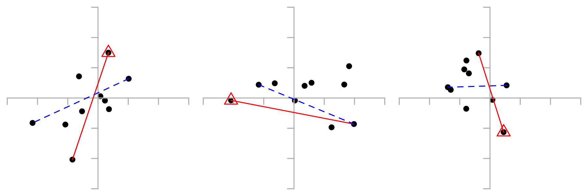
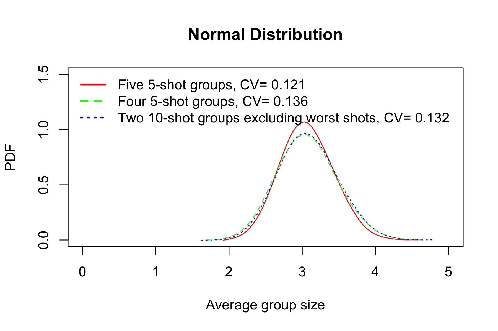
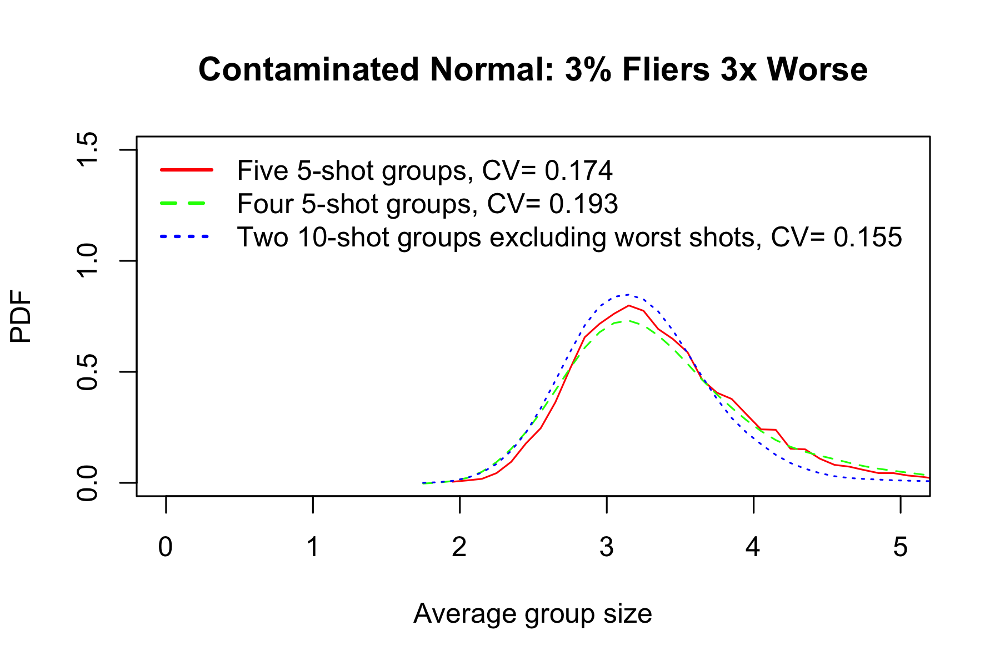

# Excluding Worst

## Extreme Spread Excluding Worst Shot

Extreme spread is, by definition, sensitive to extreme events (outliers). One way to make this estimator more robust is to simply exclude the worst shot. It must be one of the two impacts defining extreme spread. If not sure which shot to exclude, measure extreme spread without either one and take the smaller number.

To avoid bias, it is important to exclude worst shot for all groups, not just the ones with obvious outliers. 

Monte-Carlo simulations show that in a small group this approach does not work very well (because every shot is important), but in a 10-shot group it makes perfect sense.  

Here are some examples. Worst shot is marked with a red triangle. Solid red line is extreme spread. Dashed blue line is extreme spread excluding worst shot.

By convenient coincidence, extreme spread after excluding worst shot in a 10-shot group is about the same as extreme spread of regular 5-shot group.

In presence of outliers this metric performs even better. The example below shows contaminated normal distribution: to simulate outliers, random 3% of shots were pulled from distribution with standard deviation three times higher than usual. 

Any ideas how to call this metric? Moderate spread? Less extreme spread? Trimmed group size?
