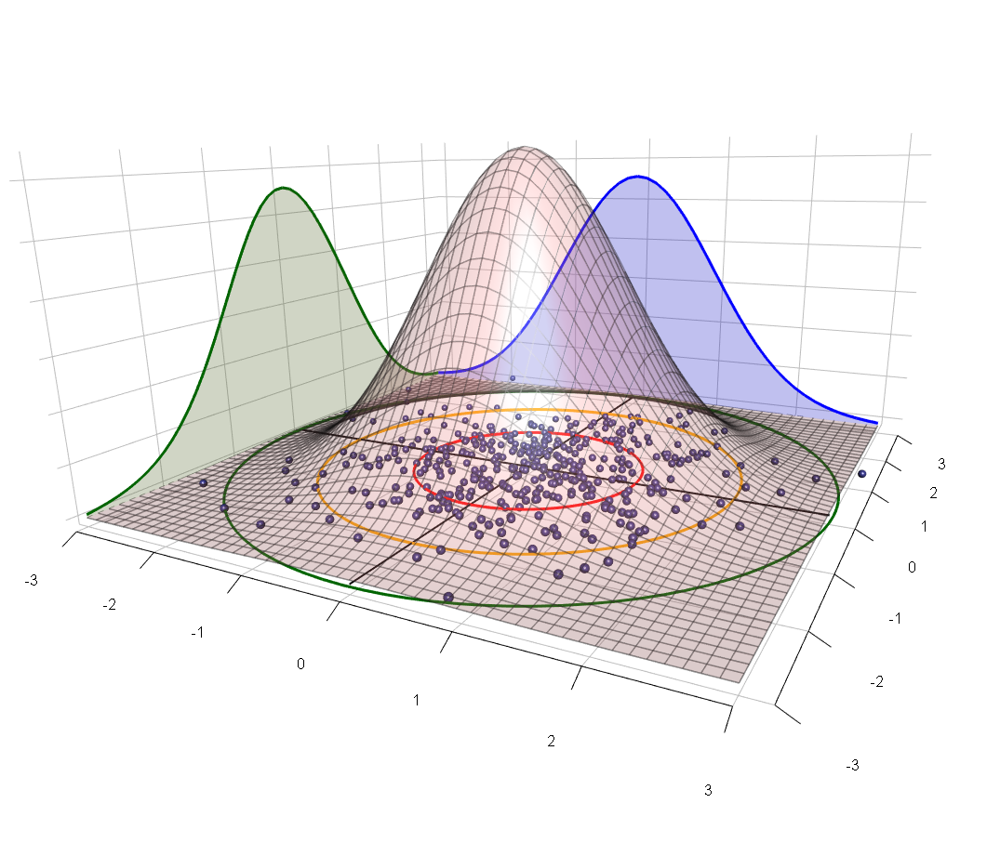
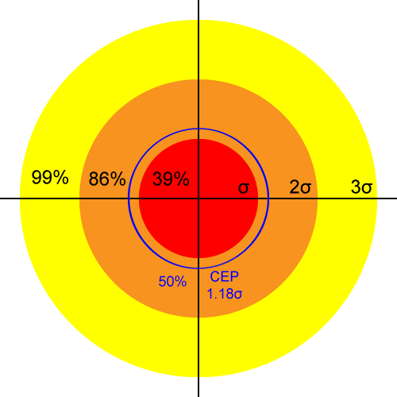
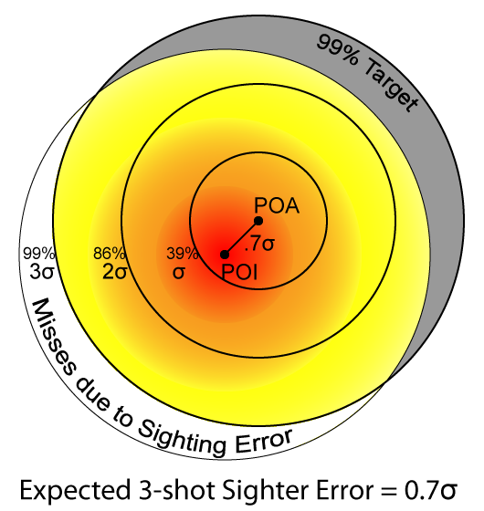

# FAQ

## What are the key points people should know about shooting precision?
1. [Extreme spread](describing-precision.md#extreme-spread) is *not* a good measure.
1. [CEP](describing-precision.md#circular-error-probable-cep) *is* a good measure.  (CEP and MR are close to the same thing since CEP is the radius of a circle expected to cover 50% of shots and MR is expected to cover 54%.)  Once you “get” CEP and the idea of the radius of a covering circle just know that you can pick the percentage covered and it’s easy to calculate – whether you want to know the radius that should cover 50%, 96%, 99.9% – it’s the same idea and calculation methodology as for CEP.  Don’t worry about what they’re called: once you can mentally extend CEP to arbitrary covering probabilities you’re set.
1. Because these are biased measures, “don’t try this at home.”  Get a validated software package or spreadsheet to do the unbiased efficient estimates and confidence intervals.
1. Combine your shot data so that you get tight confidence intervals on your estimates.

## What is sigma (*σ*) and what does it mean?

{ .figure-caption }
*Distribution of samples from a symmetric bivariate normal distribution.  Axis units are multiples of σ.*

*σ* ("sigma") is a single number that characterizes precision.  In statistics *σ* represents [standard deviation](http://en.wikipedia.org/wiki/Standard_deviation), which is a measure of dispersion, and which is a parameter for the [normal distribution](http://en.wikipedia.org/wiki/Normal_distribution).

The [most convenient statistical model](closed-form-precision.md#symmetric-bivariate-normal-shots-imply-rayleigh-distributed-distances) for shooting precision uses a bivariate normal distribution to characterize the point of impact of shots on a target.  In this model the same *σ* that characterizes the dispersion along each axis is also the parameter for the [Rayleigh distribution](http://en.wikipedia.org/wiki/Rayleigh_distribution), which describes how far we expect shots to fall from the center of impact on a target.

Shooting precision is described using [angular units](describing-precision.md#units), so [typical values of *σ*](closed-form-precision.md#typical-values-of) are things like 0.1mil or 0.5MOA.

{ .figure-caption }
*Rayleigh distribution of shots given *σ**

With respect to shooting precision the meaning of *σ* has an analog to the "[68-95-99.7 rule](http://en.wikipedia.org/wiki/68%E2%80%9395%E2%80%9399.7_rule)" for standard deviation: The 39-86-99 rule.  I.e., we expect 39% of shots to fall within 1*σ* of center, 86% within 2*σ*, and 99% within 3*σ*.  Other common values are listed in the following table:

| Name | Multiple of *σ* | Shots Covered |
| --- | --- | --- |
|  | 1 | 39% |
| [CEP](circular-error-probable.md) | 1.18 | 50% |
| [MR](describing-precision.md#mean-radius-mr) | 1.25 | 54% |
|  | 2 | 86% |
|  | 3 | 99% |

So, for example, if *σ*=0.5MOA then 99% of shots should stay within a circle of radius 3*σ*=1.5MOA.

*σ* also tells us what to expect from other precision measures.  For example, [on average a five-shot group has an extreme spread of 3*σ*](range-statistics.md#example-1).  So if *σ*=0.5SMOA and we are shooting at a 100-yard target we would expect the extreme spread of an average 5-shot group to measure 1.5".

 

## How meaningful is a 3-shot precision guarantee?
The first answer is that *any performance standard that is expressed in terms of Extreme Spread is probably meaningless*.  After all, even the most precise gun will occasionally shoot a wide 3-shot group, and a shot-out barrel will with some probability still put three rounds through the same hole.  The inherent precision of a gun is revealed over a large number of shots, and it doesn't matter how those shots are sampled: neither the gun nor the target has a memory.  If we shoot 100 rounds through a rifle, we could pick any three at random as a 3-shot group.  Therefore, a precision guarantee has to hold over a large number of shots and is more aptly expressed in terms of probabilities.  E.g., "99% of shots with our rifle will fall within a ½MOA radius."  As we will see in [Closed Form Precision](closed-form-precision.md) such a 99% claim is the same as saying 3*σ* = ½MOA, or that the rifle's precision *σ* = 1/6MOA.  Which is the same as saying [Circular Error Probable](circular-error-probable.md) = 0.2MOA.

There are two qualifications to the preceding:

1. We do know that the sample size of a 3-shot group is smaller than the sample size of larger groups, simply because [the sample center is almost certainly some distance from the true center](closed-form-precision.md#bessel-correction-factor).  This effect is covered in the section on [Correction Factors](closed-form-precision.md#correction-factors).  For example, the average 3-shot group has a mean radius $1/\sqrt{c_B(3)} \approx 80\%$ the size of the mean radius measured from twenty or more shots.
1. It is not exactly true that guns have no memory: The effects of heating and fouling can create second-order changes in both the precision and point of impact.  So it might be necessary to qualify a precision guarantee with limits on barrel temperature and/or prescriptions on how many shots be fired before and after bore cleaning.  And in the limit barrels erode and have a finite lifespan, so especially with higher-power calibers practical limits do exist on how long precision can stay constant.

## What is the best number of shots per group?

{ .figure-caption }
*Relative Efficiency of Extreme Spread estimation by group size.*

[Five or six](range-statistics.md#efficient-estimators).

If you intend to use "group size" (e.g., Extreme Spread) to estimate precision then you'll spend 13% more bullets shooting 3-shot groups to get the same statistical confidence.

Four-shot groups are only 3% less efficient than five-shot groups, so practically just as good.

 

## How many shots do I need to sight in?

{ .figure-caption }
*99% shooting errors expected from 3-shot sighting groups, which on average impact .7σ from the Point of Aim.*

It is impossible to perfectly align a sight with a gun's center of impact because if there is any dispersion in the gun's point of impact the center can only be estimated.  The problem of sighting in a gun is [the problem of estimating the location of the center of impact](closed-form-precision.md#how-many-sighter-shots-do-you-need).

We can express the expected distance of our sample center from the true center ("zero") in terms of *σ*.  The more sighter shots we take the better our estimate of the true zero's location and hence the lower our sighting error.  This is shown in the following table for sighter groups of various sizes:

| Sighter |  |  |  |  |
| --- | --- | --- | --- | --- |
| 3 | 0.7 *σ* | 0.4" | 8% | 4% |
| 5 | 0.6 *σ* | 0.3" | 6% | 3% |
| 10 | 0.4 *σ* | 0.2" | 3% | 1% |
| 20 | 0.3 *σ* | 0.15" | 2% | <1% |

The number of sighting shots you should take depends on your sensitivity to sighting error (not to mention your patience and supply of ammunition).

The last column in the table might be typical of a hunter, who can hit an area the size of his quarry's vital zone at least 96% of the time.  If he only takes 3 sighter shots the resulting sight error would only cause him to miss that vital zone an additional 4% of the time.

The 50% Target column might be more typical of a competitive shooter.  For example, if he can hit an area the size of the bullseye with 50% of his shots, but then he spends only 3 shots sighting in for a match, then he should expect to miss the center ring an additional 8% of the time due to sighting error.  If he spends 10 shots sighting in then his sighting error falls to 3%, so he would expect one additional bullseye every 20 shots (8% - 3% = 5%).

 

## How do I tell whether *A* is more accurate than *B*?
This question appears frequently in various forms.  For example:

1. Is gun *A* more precise than gun *B*?
1. Does ammo load *A* shoot better than load *B* in this gun?
1. Does this accessory affect the precision of my gun?

The mathematics for answering such questions is called [Statistical Inference](statistical-inference.md).

## What is an "unbiased estimate," and how is it different from just sampling the value?
Many statistics, including Mean Radius and sigma, have a known bias: **the *sample* values always underestimate the *true* value**.  The reasons for this are often [hidden in the math](http://en.wikipedia.org/wiki/Standard_deviation#Unbiased_sample_standard_deviation).  With very large (i.e., 3-digit) samples the bias almost disappears, but since most of the time we deal in small samples we have to apply corrections for these biases.

## What is "confidence interval," and is it based on sample size?

Yes, [confidence interval is based on the sample size](closed-form-precision.md#how-large-a-sample-do-we-need).  (In fact, holding the estimated value constant the confidence interval is a function *only* of sample size, so it is most useful for comparing the significance of estimates based on different sample sizes.)

[Invariant statistics](describing-precision.md#invariant-measures) like MR, CEP, and standard deviation do not depend on the sample size.  I.e., there is a “true” value, and we try to discover it by taking sample shots.  We start with a vague guess and as we add samples we become more confident that our estimate is close to the true value.  This convergence is reflected in the confidence interval.  Caveat: If you’re going to think hard about the confidence interval you need to reference its actual definition, and not what it might sound like it’s saying.  By definition: *the 90% confidence interval contains the true value in 90% of trials* (which is, in this case, “you shooting a sample of that size with that gun with that ammo in those conditions”).  10% of the time the calculated confidence interval will *not* contain the true value.

[Range Statistics](range-statistics.md), including the ever-popular extreme spread, increase in expected value as sample size increases.  Therefore their confidence intervals shrink with the number of sample groups, not sample shots.

**How do you get confidence intervals?**  You hope [somebody has derived the formulas to calculate them](closed-form-precision.md#confidence-intervals)!  And for those where no closed-form solution is likely to exist you [get somebody to generate lookup tables via numeric methods](range-statistics.md#small-samples).
