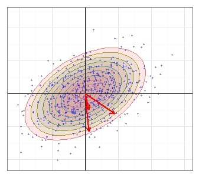
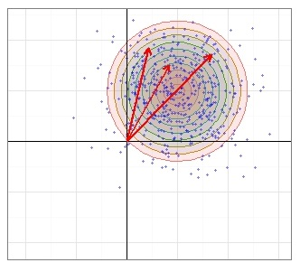

# Measuring Precision

The following text considers weapons systems precision as demonstrated by the projectile impact points on a two dimensional target. In order to have a consistent point of view the target is assumed to be be mounted as if it is a target at a rifle or pistol range. So the line of fire is assumed to be perpendicular to the target, and the target's axes are vertical and horizontal. 

# Precision Units

When we talk about shooting precision we are referring to a measure of the dispersion about a center point (which shooters adjust to match the point of aim).  There are two basic categories of units for dispersion, linear distances and as an angle. 

*Linear distance* typically uses a fixed (and specified) distance. For example the inches in diameter of a group of shots at 100 yards. Thus a linear distance measure should change in direct proportion to the distance.  

*[Angular Size](angular-size.md)* is another common unit and is the angle at the tip of the *cone of fire* since this is independent of the distance at which a target is shot.  The higher the precision, the tighter the cone and hence the smaller the angle at its tip.

## Linear Distance

In countries using the metric system the extreme spread of shots (group size) would typically be measured in centimeters (cm), or perhaps millimeters (mm). Countries (i.e. the USA) still using the British Imperial system would typically measure linear distances in inches. 

### Mil

The other common linear unit is the **mil**, which simply means thousandth.  For example, **at 100 yards a mil is 100 yards / 1000 = 3.6"**.  

**Note:** Some confusion also persists around this term, with some assuming "mil" is short for milliradian, which is an angular unit.  Fortunately, a milliradian is almost exactly equal to a mil so there’s little harm in interchanging *mil*, *mrad*, *milrad*, and *milliradian*.  

    milliradian = 3600" tan (1/1000 radians) ≈ 3.600001" inches at 100 yards
<!--
    Note also: Even **mil** is encumbered by some historical ambiguity. For example,
    western militaries going   back at least a century used an angular unit for artillery
    calculations that divided the circle into 6400 "mils," which persists the "NATO mil."

    <http://en.wikipedia.org/wiki/Angular_mil#Definitions_of_the_angular_mil>
-->
## Angular Size

The overall assumption is that the 2-dimensional precision is like a cone that projects linearly from the 
muzzle of the gun -  i.e., double the distance and the dispersion also doubles.  In many instances this model is sufficient. In reality this isn't true for all cases.  

For example due to projectile spin and aerodynamics there is some point at which a projectile's flight would degrade 
faster than the linear distance. So a 1 inch group at 100 yards might become a 10 inch group at 500 yards, and 
a three foot group at 1000 yards. 

Another example is given by cases documented where a projectile "goes to sleep." Essentially the violent exit of the 
projectile from the muzzle results in an projectile instability which is damped by air resistance. In this 
case a group might be 0.5 inches at 50 yards, but just 3/4 of an inch at 100 yards. Thus the linear group size at a 
longer distance is larger, but not geometrically larger. Note however that if you were using an angular 
measure, then the group size would be smaller at 100 yards than 50 yards. 

### Minute Of Arc

One of two popular angular units used by shooters is **MOA**, though there is some ambiguity in this term.
From high school geometry a circle is divided into 360 degrees, and each degree is divided into 60 minutes.  
Thus MOA was initially short for Minute of Arc, or arc minute, which is one sixtieth of one degree.  

**At 100 yards (3600 inches) one MOA is 3600" tan (1/60 degrees) = 1.047"**.  

### Shooter's Minute of Angle
At some point shooters began to expand the acronym as Minute of Angle.  They also rounded its correct value to 
1” at 100 yards, though for clarity the latter unit is properly called "Shooters MOA," or **SMOA**.

## Conversions between measuring units

See [Angular Size](angular-size.md) wiki page for detailed illustrations and conversion formulas.

# Variant and Invariant Target Measures

We will define the following measures as *invariant target measures*. The expected value of the measure does not change as more shots are made on the same target, rather more shots means a more precise measurement. The "cost" of a more precise measurement though is that the position of each shot on the target must be known. 

- Circular Error Probable (CEP)
- Elliptical Error Probable (EEP)
- Horizontal and Vertical Variances
- Mean Radius (MR)
- Rayleigh Distribution Mode (RDM)
- Radial Standard Deviation (RSD)

We will define the following measures as *variant target measures*. The value of the measure increases as more shots are made on the target. Using Extreme Spread as an example, 5 shots have been taken on the target. The 6th shot can't make the ES of the other five shots smaller, only larger. Hence invariant measures increase randomly with sample size. 

- Covering Circle Radius (CCR)
- Diagonal (D)
- Extreme Spread (ES)
- Figure of Merit (FOM)

The last method is the string method. Since it measures from the center of the target it conflates an accuracy measurement with a precision measurement. 

## Degrees of Freedom

Before leaving the discussion of variant and invariant target measures, one more esoteric concept needs discussion. The nature of statistics is to depend on the sample size. Usually the integer count of the sample size is identical to the statistical measure of the sample size known as the *degrees of freedom.* But the degrees of freedom does not have to be an integer quantity. It can, and for some statistical tests often does, non-integer values. In essence the degrees of freedom give you an efficiency measure of the sampling. If the sampling is 100% efficient then each additional sample not only adds 1 to the sample size, but it also adds 1 to the degrees of freedom. 

- So for the invariant target measures, each shot in the group increases the sample size by 1 and the degrees of freedom by 1.

- For the variant target measures the situation is a bit different. Each shot does increase the sample size by 1. However each shot doesn't increase the degrees of freedom by 1. Rather each shot increases the degrees of freedom by a small amount. As more shots are fired the ES measurement does, on average, get randomly larger, but it becomes less and less probable that the next shot will increase the ES. Thus each shot adds a smaller and smaller amount to the overall degrees of freedom.

# Measurement Robustness

Robustness is a straightforward notion conceptually, but mathematically fuzzy. The notion is that a robust measure would be tolerant of an outlier or of a difference in the probability distribution. 

The average is not a robust statistic. A single very large value would greatly perturb the average. However the median would be a robust statistic. A single large value, no matter how large, wouldn't change the median much. 

As with the mean, the standard deviation isn't a robust statistic. A single very large value would change the standard deviation significantly. Thus the width of the 25% quartile to the 75% quartile would be more robust. 

A number of robustness scales have been proposed, but such scales would depend on the variations that would be considered to be usual and what sorts of unusual variations the robustness of the estimator was designed to protect against. 

It is possible to take a standard statistic such as the mean and make the measurement more robust against a single large value by testing for outliers, or by trimming the data. Ideally such treatments would be done in such a way that the data treatment wouldn't introduce bias into the measurement. For instance if the data were normally distributed, then trimming the largest 10% of the measurements would bias the average low. Trimming both the highest and lowest 10% however would not bias the measurement.

# Dispersion Measures about COI

{ .figure-caption }
*When shots are dispersed circularly about the true COI, then the distance from each shot to the true COI follows a Rayleigh distribution.*

Different measures have been used to characterize the precision of bullet holes in a sample target. The measures detailed below are  popular. Some are easier to calculate than others, and thus would be suitable for range use. Others require the (*h,v*) positions of each shot and considerable calculations. Such measurements would more amiable to analysis with a calculator or computer. 

Measures of precision are directly, or indirectly, measures about the COI. Such measures do not depend at all upon the different between the COI and the POA which is the accuracy of the shooting.

The implicit goal of a parametric measurement is related to process control. In general it is ideal if there is a single number that gives a measure of the overall process quality. Then that number would allow you to make a judgement to decide if a process change results in poorer quality, the same quality, or better quality. 

!!! warning
    **!! CAREFUL !!** An old adage: **A fool with a tool is still a fool.**   

The measures and statistical analyses on this wiki will provide the shooter with tools to achieve some process control of shooting. The nature of reducing a two-dimensional pattern into a single number is not without risk. The proper use of statistics requires constant vigilance to insure that the techniques used are sound and that assumptions upon which those techniques are based are valid.

In the following sections on the various measures assume that:

1. We are looking at a target reflecting *n* shots
1. We are able to determine the center coordinates *h* and *v* as needed for analysis. For example for extreme spread we just need to be able to measure the distance between the two widest shots, but for the radial standard deviation we need the horizontal and vertical positions of each shot on the target (aka Ragged Hole Problem).
1. Appropriate consideration has been made to the underlying assumptions about shot dispersion. Unless otherwise noted the measurement assumes that a large number of shots (i.e. the population of possible shots) would have a circular (or nearly so) shot distribution.
1. Fliers are not present.

For mathematical symbols and symbols see the [Glossary](http://ballistipedia.com/index.php?title=Glossary#Mathematical_Notation).

The following headings for each measure are linked to a more detailed discussion of that measure.

### [Circular Error Probable](circular-error-probable.md) (CEP)
[[File:SCAR17 150gr 100yd.png|365px|thumb|right|Precision Measures diagrammed on a 10-shot 100-yard group. Data in [SCAR17_150gr_100yd.xls](media/SCAR17_150gr_100yd.xls)]] 
CEP(p), for $0 \leq p \leq 1$, is the radius of the smallest circle, centered at the COI, that is expected to cover proportion *p* of the shot group.  When *p* is not indicated it is assumed to be CEP(0.5), which is the true *median shot radius* (50% radius).

CEP is a robust estimator in that the median value wouldn't change much if one extreme value flier was in the measured set.

### Covering Circle Radius (CCR)

The Covering Circle Radius is the radius of the smallest circle containing all shot centers.  This will 
pass through at least the two shots used for the extreme spread measure (in which case CCR = (Extreme Spread)/2 ) or at most it will pass 
through three outside shots. Thus in general the CCR will be at least as large as ES and typically a bit larger.

The CCR(50) measurement were based on the median value then it would be a robust estimator. If it is calculated by fitting the Rayleigh distribution shape parameter to the data then it is not a robust estimator.

**See Also:** [Covering Circle Radius versus Extreme Spread](covering-circle-radius-versus-extreme-spread.md) - A discussion of the difference and interrelationship between the Covering Circle Radius and the Extreme Spread measurements.

### Diagonal (D)
The Diagonal is the length of the diagonal line through the smallest rectangle covering the sample group. Note 
that it is implicit that the rectangle is oriented along the horizontal and vertical axes. The diagonal may be 
determined by two to four points depending on the pattern of shots within the group. 

Formula:  

    $D = \sqrt{(h_{max} - h_{min})^2 + (v_{max} - v_{min})^2)}$  

where $(h_{max} - h_{min})$ and $(v_{max} - v_{min})$ are the observed horizontal and vertical ranges respectively.

The D measurement is a not a robust estimator since it depends on the extreme shot values.  

The FOM and Diagonal both really assume a underlying circular distribution. In the case that there is a small difference in the horizontal and vertical variance, the difference is essentially is "How is the *average* of both axes to be calculated?" The Diagonal uses square root of the horizontal and vertical ranges squared. The FOM is averaging the horizontal and vertical ranges as:  

$$
FOM = \frac{(h_{max} - h_{min}) + (v_{max} - v_{min})}{2}
$$

### Elliptical Error Probable (EEP)

{ .figure-caption }
*Hoyt Distribution - If the shots dispersed about the true COI in an elliptical pattern which has its major axis at an angle to the coordinate axes, then the distances from the shots to the true COI follow the Hoyt distribution.*

The EEP(p) is analogous to the Circular Error Probable (CEP), in that covers proportion *p* of the shot group with $0 \leq p \le 1$, the ellipse being centered about the COI. When *p* is not indicated it is assumed to be EEP(0.5). Elliptical Error Probable assumes that the distances from the shots to the true COI follow the Hoyt distribution, so the calculations would be flexible enough to calculate $s_h, s_v,$ and $\rho$.

The general notion is that the ratios of the major and minor axes should equal the ratios of the variances. There are numerous ways to do the actual calculation of course. 

The EEP is the "best" measurement considered which is appropriate for a non-circular distribution. Best in the sense that it would provide the most precise statistical estimates. In a computer program sophisticated enough to handle the calculation of the EEP, the CEP could be programmed as a simpler special case.

If the EEP(50) measurement is based on the median values then it would be a robust estimator. If it is calculated by fitting the Hoyt distribution to the data then it is not a robust estimator. Overall it is unlikely that this measurement would use the medians so that it would be robust since that would require an extraordinary amount of experimental data to get a good value.  
 

### [Extreme Spread](extreme-spread.md) (ES)
The *Extreme Spread* is is the largest center-to-center distance between any two points, *i* and *j*, in the group. 

Formula:  

$$
ES = \max \sqrt{(h_i - h_j)^2 + (v_i - v_j)^2}
$$

The ES measurement is a not a robust estimator since it depends on the extreme shot values. 

Statisticians have used the terms *extreme spread* and *bivariant range* for this measure. Shooters typically call this measure the *Extreme Spread* or *group size*.

**Note:** Be careful with with the phrase *extreme spread*. Shooters will often refer to the range of values from a chronograph as the *extreme spread*. Context should allow an easy determination of the correct meaning of the phrase.

**See Also:** [Covering Circle Radius versus Extreme Spread](covering-circle-radius-versus-extreme-spread.md) - A discussion of the difference and interrelationship between the Covering Circle Radius and the Extreme Spread measurements.

### Figure of Merit (FOM)

The Figure of Merit is the average range of the width and height of the group. The FOM may be determined by 
two to four points depending on the pattern within the group. 

Formula:  

$$
FOM = \frac{(h_{max} - h_{min}) + (v_{max} - v_{min})}{2}
$$

The FOM measurement is a not a robust estimator since it depends on the extreme shot values. 

The FOM of merit and Diagonal both really assume a underlying circular distribution. In the case that there is a small difference in the horizontal and vertical range, the difference is essentially is "How is the *average* of both ranges to be calculated?"

The FOM is averaging the horizontal and vertical ranges. The Diagonal uses square root of the horizontal and vertical ranges squared.   

$D = \sqrt{(h_{max} - h_{min})^2 + (v_{max} - v_{min})^2)}$  

### Horizontal and Vertical Variances

Formula:  

$$
\sigma_h^2 = \frac{\sum^{n}(h_i - \bar{h})^2}{n - 1}, \quad \sigma_v^2 = \frac{\sum^{n}(v_i - \bar{v})^2}{n - 1}
$$

Often these will be given as standard deviations, which is just the square root of variance.

The variances are not robust estimators since they weight the extreme shot values more heavily. 

### Mean Radius (MR)
The Mean Radius is the average distance over all shots to the groups center.

Formula:  

    $\bar{r} = \sum_{i=1}^n r_i / n$ where $r_i = \sqrt{(h_i - \bar{h})^2 + (v_i - \bar{v})^2}$

The MR measurement is not a robust estimator since one large extreme value could change the value significantly. 

As we will see in [Closed Form Precision](closed-form-precision.md), the Mean Radius is typically only 6% larger than the Circular 
Error Probable.  Since this is within the margin of error of most real-world usage the terms MR and CEP may be 
interchanged in casual usage.

### Rayleigh Distribution Mode (RDM)

The *mode* is the value at the peak of a distribution. Thus Rayleigh Distribution Mode (RDM) is the peak value of the Rayleigh distribution. Given that the shots follow the Rayleigh distribution, then an alternate measurement was desired other than the Radial Standard Deviation. Using the mode value of the Rayleigh distribution seems like a logical choice since:  

$$
RDM = \Re
$$

The RDM measure is directly proportional to the RSD measurement, so it has exactly the same relative standard deviation though the actual value will be a little smaller. Since the Rayleigh distribution is skewed towards larger values:

   $\text{Mean} ( = \Re \sqrt{\frac{\pi}{2}} \approx 1.253 \Re ) \gt \text{Median} ( = \Re \sqrt{\ln{4}} \approx 1.177 \Re) > Mode ( = \Re)$  

Since $\Re$ isn't calculated as the second moment about some mean, it seems more natural to think of the fitted parameter $\Re$ for the Rayleigh distribution as a special radius, than it does to think of it as "standard deviation" of some sort.

If the RDM measurement is determined from a measurement of the actual peak of a measured distribution then it would be a robust estimator. If it was calculated based on fitting an assumed distribution then it is not a robust estimator. Overall it is unlikely that this measurement would be made in the manner so that it is robust since that would require an extraordinary amount of experimental data. 

### Radial Standard Deviation (RSD)

The Radial Standard Deviation (RSD) is typically defined as $\sqrt{\sigma_h^2 + \sigma_v^2}$ in the literature. It is proportional to the constant coefficient, the Rayleigh shape parameter $\Re$, in the Rayleigh distribution equation, and has therefore served as a useful reference to that constant. 

$$
RSD = \Re \sqrt{2}
$$

The RSD is also not the same as the standard deviation of the mean radius which is given by the formula:  

   $\sigma_{MR} = \sqrt{ \frac{\sum_{i=1}^n r_i^2}{n-1}}$ where $r_i = \sqrt{(h_i - \bar{h})^2 + (v_i - \bar{v})^2}$  

In terms of the Rayleigh shape parameter $\Re$:  

$$
\sigma_{MR} = \Re \sqrt{\frac{4 - \pi}{2}}
$$

In spite of the rather sexy name there is nothing special about the RSD. Since the Raleigh distribution has a single constant to be fitted, any of its expressions which is directly proportional to to $\Re$ would have the same relative error (i.e. error as a %) as the fitted constant $\Re$.  

Using a "standard deviation" as a measure also lacks a certain intuitive feel. The other measures are all in linear units (or angular equivalents), so it would be nice if the fitted $\Re$ coefficient were used in a measurement that was linear too. Thus the main discussion of fitting the $\Re$ coefficient will be moved to the *Rayleigh Distribution Mode (RDM)* measurement where $\Re = RDM$.   

In order to avoid confusion with this measure that is both biased and misnamed, reference to RSD will be minimized.

The RSD measurement is a not a robust estimator since it is fitting an assumed distribution to the experimental data in such a way that extreme shot values are weighted more heavily.

# Other Measures

## Dispersion Measures From POA

### String Length (SL) Method

{ .figure-caption }
*Rice Distribution - The distances of the shots to the true COI follow a Rayleigh distribution, but the distances of the shots to the offset center of the target follow a Rice distribution.*

This is what could be called an "old-fashion" method for measuring a shooters skill. There are variations of the method as well. 

The gist is that a end of a string is held at the center of the target which would be the POA for the shooter. At first the end of the string is placed at the center of the target and then the string is played out to the center of a hole on the target. The string is pinched over the center of that hole, and the pinched section is moved to the center of the target. The process is repeated until all holes have been measured. Then the total length of the string is the shooter's *string length*. Thus this version of the measurement isn't just measuring precision but accuracy as well.

Formula:  

$$
SL =\sum_{i=1}^n \sqrt{(h_i - h_{POA})^2 + (v_i - v_{POA})^2}
$$

Assuming that the shot dispersion around the COI followed the Rayleigh distribution, then the individual string segments measured to the POA would follow the Rice Distribution.

The SL measurement is a not a robust estimator since it depends on the absence of extreme shot values. 

# Comparative Summary of measures

> {| class="wikitable"
! Dispersion  
Measure
! Measure:  
Invariant  
  - or -  
Variant
! Robust  
Estimator
! Shot Pattern:  
Circular  
  - or -  
Ellipitical
! Dispersion  
 Class
! Accuracy  
  - or -  
Precision
|-
| [ Circular Error Probable (CEP)](#circular-error-probable-cep)
| Invariant
| Maybe
| Circular
| Rayleigh
| Precision
|-
| [ Covering Circle Radius (CCR)](#covering-circle-radius-ccr)
| Variant
| No
| Circular
| Rayleigh
| Precision
|-
| [ Diagonal (D)](#diagonal-d)
| Variant
| No
| Circular
| Rayleigh
| Precision
|-
| [ Elliptical Error Probable (EEP)](#elliptical-error-probable-eep)
| Invariant
| Unlikely
| Elliptical
| Hoyt
| Precision
|-
| [ Extreme Spread (ES)](#extreme-spread-es)
| Variant
| No
| Circular
| Rayleigh
| Precision
|-
| [ Figure of Merit (FOM)](#figure-of-merit-fom)
| Variant
| No
| Circular
| Rayleigh
| Precision
|-
| [ Horiz. and Vert. Variances](#horizontal-and-vertical-variances)
| Invariant
| No
| Elliptical
| Orthogonal Elliptical  
  - or -  
Hoyt
| Precision
|-
| [ Mean Radius (MR)](#mean-radius-mr)
| Invariant
| No
| Circular
| Rayleigh
| Precision
|-
| [ Rayleigh Distribution Mode (RDM)](#rayleigh-distribution-mode-rdm)
| Invariant
| Unlikely
| Circular
| Rayleigh
| Precision
|-
| [ Radial Standard Deviation (RSD)](#radial-standard-deviation-rsd)
| Invariant
| No
| Circular
| Rayleigh
| Precision
|-
| [ String Length](#string-length-sl-method)
| Variant
| No
| Circular
| Rice
| SL = F(Precision, Accuracy)
|}

# Which Measure is Best?

[Precision Models](precision-models.md) discusses in more detail the assumptions about shot dispersion. The disconcerting truth is that there is no *universally best measurement*. All measurements are dependent on assumptions about the "true" distribution for the dispersion of  individual shots, and about the presence of true "fliers" in the data. In practice the effect of neither of these factors is known. 

The lack of an absolute truth may be mitigated with an expectation of making reasonable assumptions and picking a mathematical model that is *good enough*. In essence start with a simple assumptions and model, and if the data indicates that the assumptions or model are inadequate, then increase the complexity of the model. Here complexity of the model essentially means the number of parameters which are determined experimentally. So the Rayleigh model has three experimental parameters (average horizontal position, average vertical position and the standard deviation of the radius), but the full bivariate normal distribution has five ((average horizontal position, average vertical position, the horizontal standard deviation, the vertical standard deviation and ρ). The drawback here is that since the full bivariate normal distribution has more parameters to fit experimentally, it would require more data to obtain a good experimental fit. 

Shooters use the term *flyer* to denote the statistical term *outlier*. An outlier denotes an expected "good shot" with an abnormally large dispersion. So a shot that is much father than average from the center of the group would be a flyer. On the other hand, let's assume that the shooter realizes that his rifle was canted as the rifle discharges. The shooter would call that a "bad shot" before determining the shot position and would ignore that shot when making his measurements regardless of where the projectile landed. 

It is convenient to consider the Rayleigh distribution function (or the full bivariate Gaussian as appropriate)
as the gold standard given the situation that the underlying assumptions about shot dispersion and the
lack of outliers holds. In this situation the Rayleigh model is 100% efficient since it makes as much use
of the statistical data as is theoretically possible. In statistics the standard deviation of a measurement divided by the measurement expresses the error as a dimensionless percentage. The efficiency of various measures can be thus compared by using the ratios of the relative standard deviations squared. 

However one must be careful to not be too swayed by theory as opposed to experimental reality. In reality the conformance to theory is only due to a lack of enough precise experimental data to infer that the theory is incorrect. Also most of the measures are not http://en.wikipedia.org/wiki/Robust statistics robust estimators.

!!! warning
    "The difference between theory and practice is larger in practice than in theory."
