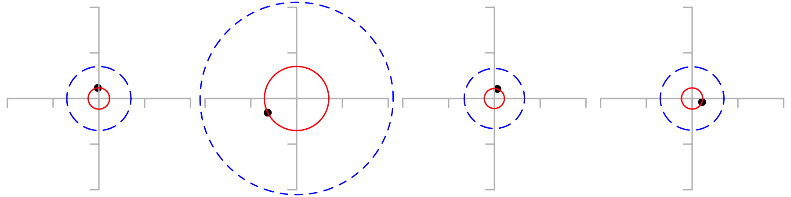
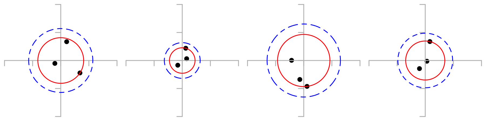
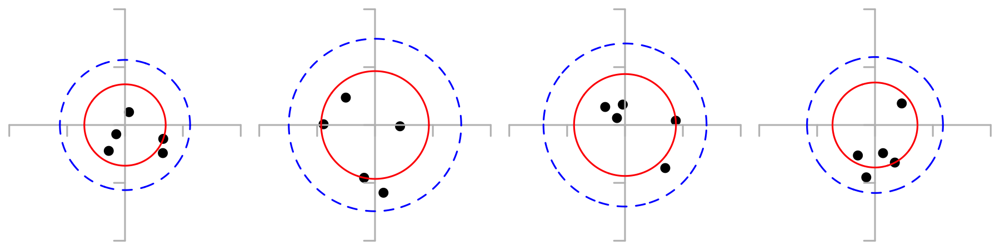

# Order Statistics

Order statistics provide "field estimates" that are easy to measure and compute.

## Shortcuts to Estimating R~90~

A typical hunter is interested in the 90% CEP, also called R~90~: the radius around point of aim expected to contain 90% of shots.  ([As shown previously, R~90~ = 2.15 *σ*](closed-form-precision.md#summary-probabilities).)

Let $R_{m:n}$ be the *m^th^* smallest radius (i.e., *(n-m+1)^th^* "worst") of *n* sample shots on a target.

- If you can only take one shot then $\hat{R_{90}} = 3 R_{1:1}$
- If you can only take three shots then $\hat{R_{90}} \approx 1.4 R_{3:3}$
- If you take five shots and throw away the worst, $\hat{R_{90}} \approx 1.5 R_{4:5}$

Note that estimates for *n*<5 are only effective if you assume that the gun is already [zeroed](closed-form-precision.md#how-many-sighter-shots-do-you-need).

[Monte Carlo simulation here](https://github.com/dbookstaber/ballistipedia/blob/main/Simulations.ipynb) as well as  [further analysis here](http://lstange.github.io/mcgs/).

## Motivational Example

You borrow a rifle for the hunt. The owner says it is zeroed and you trust him. But you don’t know how well you can shoot this rifle, or how your ammo performs in it. You want to determine how big a target you can hit, or equivalently how far you can hit a target of a given size. For simplicity assume <s>spherical horse in vacuum</s> that the target is round and the distance is small enough that you don’t have to worry about holdovers and can ignore wind.

By the way, this is what professional hunters do when they bring their client to the range the day before the hunt to “zero the rifle”. They know the rifle is zeroed. They want to know how close they need to get this particular client to the game animal for the hunt to be successful.

## Metric Choice

One metric particularly useful in practice is $R_{90}$: the radius of a circle that is expected to contain 90% of all impacts.

This choice is a compromise. $R_{100}$ is much easier to estimate, but knowing the trivial fact that $R_{100}=\infty$ does not help much. Given available number of shots, there would not be enough tail events to determine $R_{99}$ or even $R_{95}$ with sufficient accuracy. From the other side, $R_{50}$ aka CEP might be reasonable for military applications, but is too low for civilian use.

In theory it’s easy to convert between different metrics, but in practice it’s better to have a way to get the metric you want directly with the least amount of math to be done in the field.

One nice side effect of choosing $R_{90}$ is that it allows to sidestep the tricky [Fliers vs. Outliers](fliers-vs.-outliers.md)  question. We simply decide to not care about the few worst shots, regardless of the reason. And if fliers are more frequent, they probably aren’t really fliers.

So you go to the range, set up some paper targets at typical engagement range, shoot at them, and look at the results.

## One Shot

Even one shot is better than nothing. If miss radius (the distance between target center and impact) is $R_{1:1}$, then estimated $R_{90}$ is

$$
\hat{R_{90}} = 3 R_{1:1}
$$

In examples below red circle has radius $R_{1:1}$ and blue circle has radius $\hat{R_{90}}$.

All impact coordinates were pulled from the same standard bivariate normal distribution, but the circles look very different in size, which means that the variance of the estimate is quite high.

***Details***

Here’s the math behind the magic number 3. Assume miss radiuses of individual shots follow Rayleigh distribution with $\sigma = 1$. Its probability density function is

$$
f(x)=x e^{-\frac{x^2}{2}}
$$

and cumulative distribution function is

$$
F(x)=1-e^{-\frac{x^2}{2}}
$$

$x$ here is miss radius rather than horizontal coordinate. $R_{90}$ and $x$ are measured in the same units and there are no other factors involved, so $R_{90}$ should be proportional to $x$ with some yet unknown dimensionless coefficient $k$. Probability that miss radius of the next shot is greater than $kx$ (complementary cumulative distribution function) is

$$
1-F(kx) = e^{-\frac{k^2 x^2}{2}}
$$

Integrating over all values of $x$ gives total probability of the next miss radius exceeding $R_{90}$, which should be equal to 10%:

$$
\int_{0}^{\infty}f(x)\left(1-F(kx)\right) dx = \int_{0}^{\infty}x e^{-\frac{x^2}{2}} e^{-\frac{k^2 x^2}{2}} dx = (1 - 90\%)
$$

This equation is easy to solve on paper, but it will soon get more interesitng so why not warm [Maxima](http://maxima.sourceforge.net) up now to find $k$.

  find_root(integrate(x*exp(-x^2/2)*exp(-k^2*x^2/2), x, 0, inf)=0.1, k, 1, 10);
  3.0

## Three Shots

If worst miss radius in the three-shot group is $R_{3:3}$, then

$$
\hat{R_{90}} = \sqrt{2} R_{3:3} \approx 1.4 R_{3:3}
$$

In examples below red circle has radius $R_{3:3}$ and blue circle has radius $\hat{R_{90}}$.

***Details***

Here’s where $\sqrt{2}$ comes from. Probability density of $m$th miss radius in a group of $n$ shots is

$$
f_{m:n}(x)=\frac{n!}{(m-1)!(n-m)!}\left(F(x)\right)^{m-1}\left(1-F(x)\right)^{n-m}f(x)
$$

For $m=3$ and $n=3$

$$
f_{3:3}(x)=\frac{3!}{(3-1)!(3-3)!}\left(F(x)\right)^{3-1}\left(1-F(x)\right)^{3-3}f(x)=3\left(F(x)\right)^{2}f(x)=3\left(1-e^{-\frac{x^2}{2}}\right)^{2} x e^{-\frac{x^2}{2}}
$$

Integrating over all values of $x$

$$
\int_{0}^{\infty}f_{3:3}(x) (1-F(kx)) dx = \int_{0}^{\infty}3\left(1-e^{-\frac{x^2}{2}}\right)^{2} x e^{-\frac{x^2}{2}} e^{-\frac{k^2 x^2}{2}} dx = (1 - 90\%)
$$

Solving for $k$, we get

 find_root(integrate(3*(1-exp(-x^2/2))^2*x*exp(-x^2/2)*exp(-k^2*x^2/2), x, 0, inf)=0.1, k, 1, 10);
 1.414213562373095

## Five Shots

So far we have ignored the issue of outliers (fliers), but with five or more shots we can finally do something about them: look at the <em>second worst</em> miss radius instead of the worst miss radius.

$$
\hat{\sigma} \approx 0.7 R_{4:5} \quad \therefore \quad \hat{R_{90}} \approx 1.5 R_{4:5}
$$

In examples below red circle has radius $R_{4:5}$ (4^th^-smallest miss radius in a 5-shot group), and blue circle has radius $\hat{R_{90}}$.

***Details***

According to formula 3.13 in M. M. Siddiqui 1964 paper in [References](references.md), optimum unbiased estimator from single order statistic $R_{m:n}$ is

$$
m \approx 0.79681(n+1)-0.39841+\frac{1.16312}{n+1}
$$

For $n=5$ optimum estimator is $m=5$, but $m=4$ is not far behind (relative efficiency 96.3%) and is less sensitive to outliers. There is a sharp drop after that, relative efficiency of $m=3$ (median miss radius) is 76.3%.

Probability density of $m$th miss radius in a group of $n$ shots is

$$
f_{m:n}(x)=\frac{n!}{(m-1)!(n-m)!}\left(F(x)\right)^{m-1}\left(1-F(x)\right)^{n-m}f(x)
$$

For $m=4$ and $n=5$

$$
f_{4:5}(x) = \frac{5!}{(4-1)!(5-4)!}\left(F(x)\right)^{4-1}\left(1-F(x)\right)^{5-4}f(x) = 20\left(F(x)\right)^{3}\left(1-F(x)\right)f(x) = 20\left(1-e^{-\frac{x^2}{2}}\right)^{3} e^{-\frac{x^2}{2}} x e^{-\frac{x^2}{2}}
$$

Integrating over all values of $x$

$$
\int_{0}^{\infty}f_{4:5}(x) (1-F(kx)) dx = \int_{0}^{\infty} 20\left(1-e^{-\frac{x^2}{2}}\right)^{3} e^{-\frac{x^2}{2}} x e^{-\frac{x^2}{2}} x e^{-\frac{k^2 x^2}{2}} dx = (1 - 90\%)
$$

Solving for $k$

 f45(x):=20*(1-exp(-x^2/2))^3*x*exp(-x^2);
 find_root(integrate(f45(u)*exp(-k^2*u^2/2),u,0,inf)=0.1, k, 1, 2);
 1.578643529936508

Relative efficiency of $R_{4:5}$ compared to $R_{5:5}$:

 f45(x):=20*(1-exp(-x^2/2))^3*x*exp(-x^2);
 mean45:integrate(x*f45(x),x,0,inf);
 f55(x):=5*(1-exp(-x^2/2))^4*x*exp(-x^2/2);
 mean55:integrate(x*f55(x),x,0,inf);
 float((integrate(x^2*f55(x),x,0,inf)-mean55^2)*mean45^2/((integrate(x^2*f45(x),x,0,inf)-mean45^2)*mean55^2));
 0.9627613473444434

# Order Statistics for larger *n*
For higher group sizes we can improve the estimate by using more than one order statistic.  All possible variations up to *n*=15 are listed in
[*Determination of the Exact Optimum Order Statistics for Estimating the Parameters of the Exponential Distribution from Censored Samples* (Saleh, 1967)](media/Order_Statistics_of_Exponential_Distribution_in_Censored_Samples.pdf).

For example, with a 10-shot group (i.e., *n*=10) we can get an 87% efficient estimate of *σ* by looking at the 6th and 9th worst shots.  From the reference (Saleh, 1967, p.288): $\widehat{R^2} = 0.4913 R^2_{(6)} + 0.3030 R^2_{(9)}$ which we can plug into our *σ* estimator to get 

$$
\hat{\sigma} = c_G(2n-1)\sqrt{\frac{n \widehat{R^2}}{2(n-1)}} \approx \sqrt{\frac{10}{18}(0.4913 R^2_{(6)} + 0.3030 R^2_{(9)})} \approx \sqrt{0.28 R^2_{(6)} + 0.17 R^2_{(9)})}
$$

Here is a sample 10-shot target with this calculation:
center
