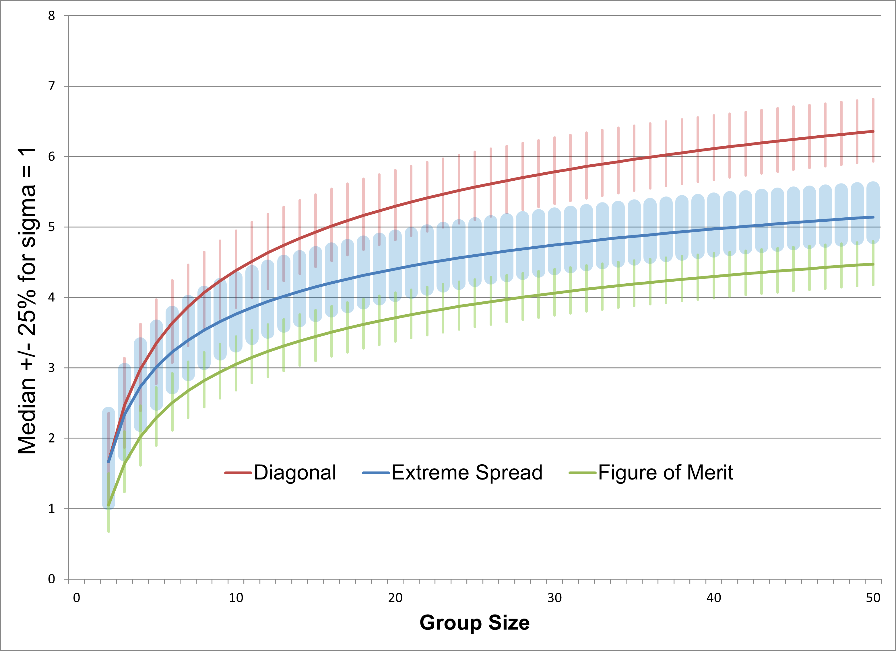

# Range Statistics

{ .figure-caption }
*Median values for size statistics when *σ* = 1.  Bands cover 50% of samples around each median.*

The three measures that vary with *n* ([Extreme Spread](describing-precision.md#extreme-spread), [Diagonal](describing-precision.md#diagonal), and [Figure of Merit](describing-precision.md#figure-of-merit)) are range statistics that lack convenient functional forms.  However both the mean and standard deviation of their expected value, as well as quantiles, scale directly with *σ*, so it is sufficient to calculate those statistics once for *σ* = 1 and multiply the resulting values by the desired *σ*.  [Sigma1RangeStatistics.xls](media/Sigma1RangeStatistics.xls) contains quantiles and moments for *n* up to 100.

The [shotGroups app](https://github.com/dwoll/shotGroups) provides an interactive online tool to estimate Rayleigh *σ* from measured range statistics, including its confidence interval. The app also performs calculations for the efficiency of the Rayleigh estimator vs. range statistics (see below).

## Example 1
*What extreme spread should I expect for 5-shot groups from my rifle?* The extreme spread median [from the table](media/Sigma1RangeStatistics.xls) for 5 shots is 3.0 *σ*.  I've determined my rifle has precision *σ* = ½MOA.  If I take five shots at 100 yards we would expect half my groups to be less than 3.0/2 = 1.5MOA $\approx$ 1.6".

Multiplying the rest of the distribution data for that row by my 0.5MOA we can also say that the extreme spread of my 5-shot groups should exhibit the following distributions:

- 50% between (1.2, 1.8)MOA
- 80% between (1.0, 2.1)MOA
- 95% between (0.8, 2.4)MOA

## Example 2
Over many tests I have found my rifle produces 5-shot groups with an average extreme spread of 1MOA.  *What extreme spread should I expect if I instead start shooting 10-shot groups?*  [The table](media/Sigma1ShotStatistics.ods) shows that the ratio of expected extreme spreads on 10-shot groups is 1.24 times the value on 5-shot groups.  So my a priori expectation would be for 10-shot groups to average 1.24MOA.

# Estimation

Following the Central Limit Theorem we can use the sampling distribution of the mean to make statistical inferences.  The methods for this are detailed well by [Kolbe](prior-art.md#kolbe-2010-group-statistics).  Suppose we want to estimate a gun's extreme spread.  We need to specify three values:

1. Shots per group, ***n*** – because range statistics increase with the number of shots taken.
1. Sampling Error, ***E*** – half the width of the confidence interval for the true value, above and below the estimated value, as a fraction of the estimated value.
1. Confidence Level ***K*** – the coverage probability of the confidence interval. Roughly, it reflects the confidence that the true value is within ***E*** of the estimated value (on either side). The width of the CI indicates the amount of uncertainty behind the point estimate - a narrower CI means less uncertainty about the true value. The precise technical meaning is harder to grasp: The CI is calculated using a method that, in the long run, guarantees it will include the true parameter value ***K*** percent of the time if all model assumptions are valid.

The number of groups ***g*** we need to shoot and measure in order to estimate the extreme spread **±*E*** with confidence ***K*** is given by

$$
g = (\frac{Z V}{E})^2
$$

where:

- ***V*** is the Coefficient of Variation, which is equal to the standard deviation divided by the mean for the given group size ***n*** in [Sigma1RangeStatistics.xls](media/Sigma1RangeStatistics.xls)
- ***Z*** is the Critical Value associated with ***K***, which is the inverse of the standard normal.  The spreadsheet function for ***Z*** is `=NORMSINV(*K* + (1-*K*)/2)`

The required data and formulas for this calculation can be found in [RangeStatisticEstimation.xls](media/RangeStatisticEstimation.xls).

## Efficient Estimators

{ .figure-caption }
*Relative Efficiency of Extreme Spread estimation by group size.*

If our goal is to characterize a range statistic using the least number of shots then we should pick our group size carefully.  [Kolbe](prior-art.md#kolbe-2010-group-statistics) et. al. noted that for any desired error and confidence level it looked like 7-shot groups produced a significant estimate using the lowest number of total shots fired.  [Using our more extensive simulations of the coefficient of variation we can see now](media/RangeStatisticEstimation.xls) that **6-shot groups are actually the most efficient**, and that **5-shot groups are practically as efficient** (and for many scenarios identical).

4- and 8-shot groups are almost as efficient, but if you're shooting 3-shot groups or groups larger than 9 shots then you are wasting bullets.

## Small Samples
In practice we are usually limited to shooting small numbers of groups, which will have significant positive skewness.  In order to more accurately characterize the distribution of small samples we fall back on direct simulation to produce quantile functions.  [ES_Quantiles.c](media/ES_Quantiles.c) runs 2 million iterations per scenario, with a number of small scenarios shown in [Extreme Spread Quantiles.xlsx](media/Extreme%20Spread%20Quantiles.xlsx).

We can see that the skewness disappears quite rapidly as we average samples: The following table shows the 90% quantiles on averages of 5-shot groups, with the median normalized to 1:
| Total Shots | Groups | 5% Level | 95% Level |
| --- | --- | --- | --- |
| 5 | 1 | 0.60 | 1.50 |
| 10 | 2 | 0.71 | 1.34 |
| 15 | 3 | 0.76 | 1.27 |
| 20 | 4 | 0.79 | 1.23 |
| 25 | 5 | 0.81 | 1.21 |

By the time we're looking at the average of five 5-shot groups our distribution has almost no skew.

### Example: NRA's Test Protocol
As noted previously, the NRA's standard for testing precision is to shoot five consecutive 5-shot groups and report the average extreme spread.

As we saw in the preceding section, the 90% confidence interval for five 5-shot groups is (0.81, 1.21).  That is applied to the sample statistic, so if we measure an average 5x5 extreme spread of 0.7MOA then the 90% confidence interval on that estimate is 0.7MOA × (0.81, 1.21) = (0.57MOA, 0.85MOA).

How efficient is this test protocol?  From [Closed Form Precision](closed-form-precision.md) we know that the best precision estimator for a symmetric bivariate process is the Rayleigh estimator, so using [RayleighEstimatorQuantile.c](media/RayleighEstimatorQuantile.c) we simulated quantile curves for that as well: [RayleighEstimatorQuantiles.xls](media/RayleighEstimatorQuantiles.xls) provides quantiles for groups ranging from 2 to 50 shots.  From these data we can see that the 5% and 95% quantiles of the Rayleigh estimator reach the confidence range (0.81, 1.21) – the range the NRA protocol achieves with 25 shots – after just 19 shots.  I.e.,

- Following the best estimation methodology you can measure precision as effectively as the NRA protocol does but use only 3/4 as many bullets.
- Following the NRA protocol you’re spending 32% more ammo than necessary to get the same precision estimates.
(Granted, unless you have an electronic target, it’s easier to measure and average 5 extreme spreads in the field than to measure the radius of each shot and [compute the corrected sum of squares](closed-form-precision.md#rayleigh-estimates), so that trade-off may be worthwhile.)
