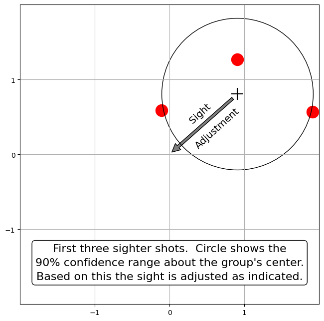
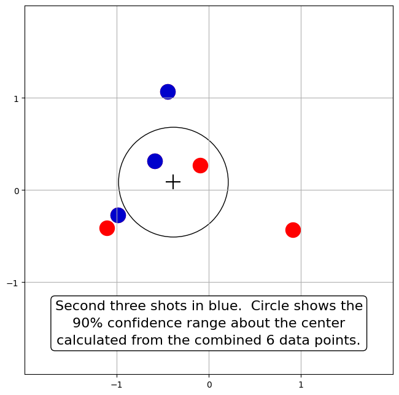
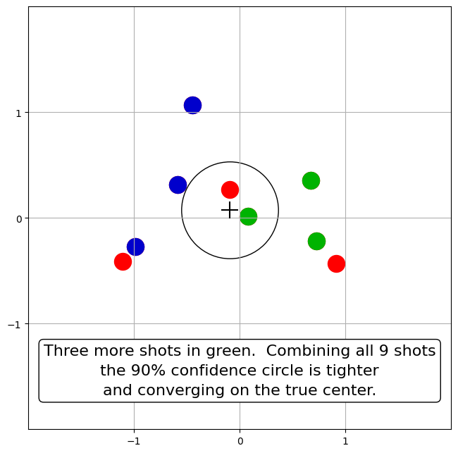
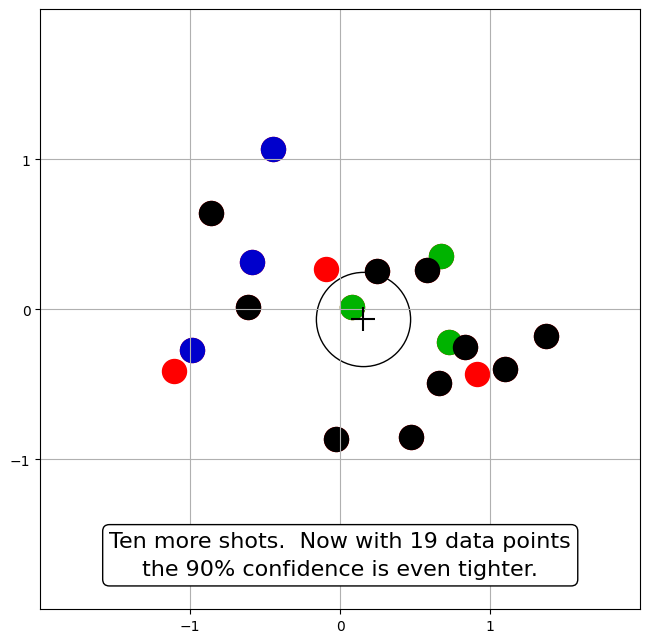

# Sight Zeroing Example

... back to [Closed Form Precision](closed-form-precision.md#how-many-sighter-shots-do-you-need)

This example shows how confidence in the center of impact increases with the number of shots used to compute it.  We're showing the 90% Confidence region, or CEP(90%), which is the area (around the sample center) that should contain the true center 90% of the time.  [As detailed here](closed-form-precision.md#summary-probabilities), CEP(x) = $\sigma \sqrt{-2 \ln(1-x)}$, and for purposes of estimating the true center the radius of that region scales with the square root of the number of shots *n* used to compute it.  I.e., 90% of the time the true center is inside the circle of radius $\frac{CEP(90\%)}{\sqrt{n}}$ about the sample center.

The following diagrams are based on a simulation with σ=1.  The first group was simulated with the sights misaligned to center on (1, 1).  ***Nota Bene:** In real life we don't get to know the true center of impact.  We can only estimate it by looking at where shots hit.*  In this example we know the true center because it was specified in the simulation.

Based on the first group's center hitting near that point, the sights are adjusted down 1 MOA and left 1 MOA.  The record of those first three shots is also adjusted by that amount so that they can continue to contribute to the estimate of the gun's zero.

Shots on all of the following targets were simulated with a center at (0,0).

