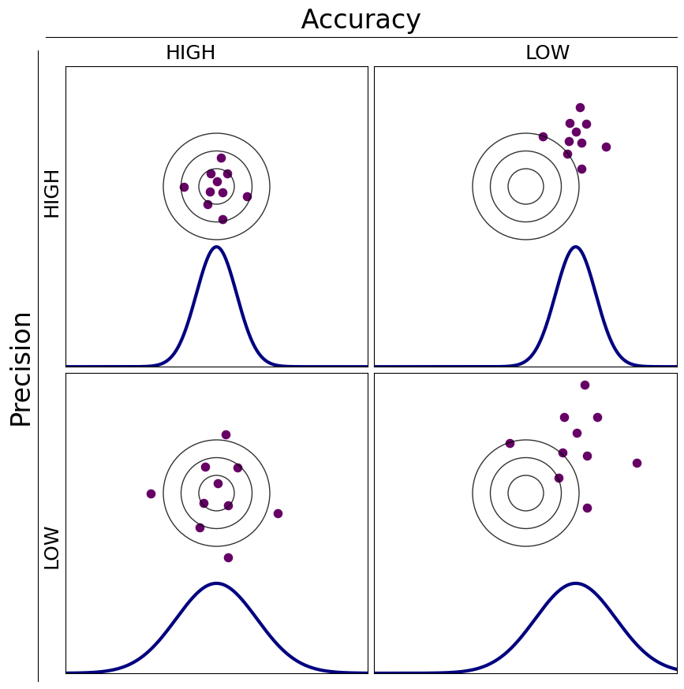
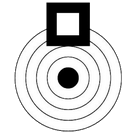

# Precision vs Accuracy

Before going any further we need to distinguish precision from accuracy, and show why we care so much about the former, but won't be dealing with the latter at all.  Note that here we use the specific statistical meaning of these terms, even though in casual usage they are often sloppily interchanged.

**Accuracy** refers to how well shot groups are centered on a target, and is essentially a problem of sighting-in a shooting system. If the shot group doesn’t center on the desired target the assumption is that the weapon merely needs to have its point of aim adjusted. It is implicitly assumed that the aim adjustments can be made finely enough to that any difference between the average POA and POI would be statistically insignificant. 

**Precision** describes the spread of individual shots about the center point of a shot group.  A precise shooting system will, over many shots to and from the same points, produce a tight shot group with *smaller* distances between individual shots than a less precise system. However in contrast to accuracy, precision can't be "adjusted" into a shooting system by dialing some knob on the weapon. 

 

# Precision in Shooting

When discussing the precision of shooting systems it is typical to consider three major subsystems, the weapon, the ammunition, and the shooter. However when analyzing a target the only directly observable precision is the precision of the whole system. Thus the observable error is something like:  

    $\sigma_{System}^2 = \sigma_{Weapon}^2 + \sigma_{Ammunition}^2 + \sigma_{Shooter}^2 + \sigma_{Sighting}^2$

On one extreme are devices like [rail guns](http://www.google.com/url?q=http%3A%2F%2Fwww.box.net%2Fshared%2Fstatic%2Fvs86o5rcf9.jpg&sa=D&sntz=1&usg=AFQjCNHgAZE23FQbP9UpZsu5eFClvL4cGQ), which are little more than barrels which are overly large and clamped rigidly in a machine rest. Rail firearms are typically built to such fine tolerances that their extraordinary shooting precision is determined primarily by the quality and fit of ammunition.  Typical firearms used by shooters have more variability in production and operation that outweigh the dispersion inherent in high-quality ammunition.  

On the other extreme an inexperienced shooter, or even an experienced shooter who has to fire from an unsupported position, will typically add dispersion to the shot pattern greater than that produced by a good weapon or ammunition. Hence the overall precision observed is dominated by the shooter. 

Therefore, when we talk about precision it is important to assess the weapon system being tested to guide experimentation: 

- If it’s a competent shooter with a good sight shooting from his preferred supported position, then the dominant factor will probably be the gun and ammunition.
- If ammunition is match-grade factory or, better yet, custom-loads tuned to the gun, then the weapon might be the dominate factor in precision.
- For the shooter using commercial ammunition, and a stock commercially manufactured weapon, then all three parts of the weapon system (ammunition, weapon and shooter) might make significant contributions to the overall error.

An ideal shooting system would have zero dispersion, or perfect precision.  In reality, when shooting from a fixed position at a fixed target dispersion will be observed. Some basic overview of typical error sources will be discussed in the following subsections. 

## Measurement

In the real world the overall system variance includes measurement errors. Conceptually at least each hole position would have some error associated with it. So the overall system variance should really be:  

    $\sigma_{System}^2 = \sigma_{Weapon}^2 + \sigma_{Ammunition}^2 + \sigma_{Shooter}^2 + \sigma_{Measurement}^2$

Unless noted in some special considerations, it is assumed that $\sigma_{Measurement}^2$ is insignificant. For example when measuring extreme spread it would be very unusual for the measurement error to be significant. Thus measuring a 5-shot group which has a 1.507 inch extreme spread measurement to a thousandth of an inch has vastly more measurement precision than shooting repeatability.

## Weapon

A gun won't have a "precision" knob that can be adjusted as desired. However a gun will typically have a number of characteristics that can be modified to affect its overall precision. For instance consider a these modifications to a rifle:

- Barrel Changes
> > - A "bad" barrel can be exchanged for a "good" barrel.
> > - It might be possible to fix a "bad" barrel, for example by recrowning the barrel.
- Sights
> > Iron sights might be replaced by a telescopic sight.
- Bedding
> > The rifle might be bedded to the stock to effectively increase the mechanical stiffness of the barrel and hence reduce the effects of vibrations and vibration harmonics. The mechanical stiffness is increased since after bedding the barrel should make the barrel contact  the entire length of the forestock instead of at the high point(s).

## Ammunition 

The overall precision of weapons is often dependent on the type and quality of the ammunition used. Firearms are notorious for "liking" a particular brand of ammunition. Sometimes the manufacturer will change production parameters for that brand of ammunition and the shooter must begin to experiment again to find the best ammunition for the weapon.  

Some typical considerations for ammunition include:

- Irregularities in its dimensions and their fit to the gun's chamber can introduce yaw moments that begin as soon as the bullet starts to move out of the chamber and into the bore of the barrel.
- Variations in powder charge and burning can affect muzzle velocity.
- Variation in dwell time, how long the bullet is in the barrel, can introduce dispersion in because of the harmonics in weapon vibration.
- Different shape and weight projectiles have different ballistic coefficients (i.e. air drag values).
- The hand-loader has a multitude of factors. For instance bullet type, cartridge dimensions, primer type, powder type, and powder weight are some of the factors that a hand-loader can test.

## Shooter

All shooters do not have the same skill level. An ideal shooter would be able to replicate the shooting process so perfectly so as to be an insignificant factor in the overall precision of the weapon. In the real world this doesn't happen because of a number of factors such as:

- Shooting stance. Perhaps five different stances would need to be considered. Prone, sitting, standing, rested, and bench rested.
    - Prone, sitting, and standing are done with the shooter not using any sort of mechanical support. Precision differences are typically observed between such positions with prone the best and standing the worse.
    - Rested - The shooter would have some sort of mechanical support available such a rail or wall upon which his forward hand could be rested when shooting a rifle.
    - Bench Rested - Shooting from a bench rest is done with the weapon resting on bags, front and rear, to reduce the shooter factor as much as possible, but still use a "real" weapon. "Real" weapon in the sense that the weapon is one which would be used in the field.
- An ideal shooter can sight the gun to the exact same point each shot.
> > No shooter can in fact hold sights absolutely steady. So the shooter must be able to release the trigger at the point that the sight is crossing the desired POA.
- An ideal shooter would release the trigger consistently.
> > Yanking the trigger for example would cause the sights to move.
- An ideal shooter would make perfect shoots regardless of distance.
> > This requires the shooter to know both the distance to the target accurately, and the ability to make the corrections needed between the zeroed POA and the target distance.
- An ideal shooter would be able to make the appropriate allowance for wind.
> > "Appropriate allowance" means good enough in this sense, or as good as the best shooter would be able to do.

In the real world, the variations in the above factors, and others, are observed as increased shot dispersion.

### Target Distance

If shooting at some other distance than which the weapon was *sighted*, then adjustments must be made in the sighting to account for the distance variation. 

The change in POI from the POA is due to the bullet's drop due to gravity. Consider a rifle shooting a bullet absolutely horizontally. As the bullet travels downrange it drops due to the pull of gravity. In fact gravity accelerates the drop as a function of time. So the bullet's drop is a function of how long it takes to get to the target.

In reality the simplest correction assumes that the projectile has an aerodynamic drag that is constant regardless of its absolute velocity. The drag is typically used as the inverse called the ballistic coefficient. In essence such a ballistic coefficient allows for the time to the target to be calculated. From this time the projectile drop can be calculated. 

$$
h_{Drop} = \frac{1}{2}gt^2
$$

> using gravity constant as 32.2 ft/sec^2, 12 inches in a foot, and $t_{flight}$ as the flight time in seconds, then the drop in inches is:

$$
h_{Drop} = 193.2 t_{flight}^2
$$

There is also the concept of *point blank range* which means that the difference vertical drop between two distances is insignificant with respect to making a *kill shot* in hunting. So a rifle could be zeroed at 100 yards, but a "well-placed" shot at same the point of aim would produce a kill at perhaps a distance of 50 to 150 yards. So the *point blank range* would be 50 to 150 yards. 

### Wind doping

Finally, if instead of shooting 100-yard targets on a calm day the target is shot at 1000 yards with significant winds then the shooter’s ability to read wind may be the dominant source of precision.

(NB: At longer distances wind can introduce errors in both accuracy and precision.  Shooters who can compensate for wind will apparently have higher precision, but we prefer to say they are reducing the error term that the wind adds on top of the intrinsic precision of their system, which is independent of the distance shot.)

## Sighting

The sighting error is referring to an inherent error in the sighting process due to sampling rather than errors due to a shooter's ability to aim. Sights are adjusted based on a center of impact measurement which by definition must be imperfect. The imperfection in this case is due to sampling  since only $n$ sighter shots are used instead of an infinite number. Thus even we we could measure the COI on the target perfectly and if we could adjust our sights perfectly based on that measurement, we'd still never be able to adjust the sights perfectly. 

Here perfection doesn't mean that ever shot would land on the center of the target. Rather perfection in this case can be illustrated in a different way. Instead of adjusting the sights after each sighter target done using our normal procedure, we simply write down the horizontal and vertical corrections. We the shoot a million sighter targets. Now we average the positions over the million targets and adjust the sights. Now assuming that the weapon can "hold zero," it will be "perfectly" sighted. 

Since perfection is unobtainable, the goal is to simply to make the sighting error insignificant. To effectively make the sighting error insignificant we should strive for at least:

    $\sigma_{Weapon}^2 + \sigma_{Ammunition}^2 + \sigma_{Shooter}^2 > 3 \sigma_{Sighting}^2$

 Note also that precision shooters will often intentionally align their sights so that groups do *not* center on their aiming point so that their aiming point isn't degraded or "shot out" for subsequent shots.  For example, a common load development target is the one shown here on the left: The shooter aims for the bullseye, but sights the rifle high so that impacts are in the square box above it.

## Subsystem Interactions

There are some obvious subsystem interactions which may or may not be important in the overall precision of a weapon system. Since the wiki isn't a complete discourse on ballistics the list isn't intended to be exhaustive, but rather illustrative. Consider the following factors for a rifle:

; Target distance differences
> The ballistic coefficient is determined by ammunition factors, but it effects time to target. The shooter must be able to correct for the difference in distance between the zero distance and the target distance. The muzzle velocity of a firearm is dependent on barrel length.

; Cheek weld 
> If the rifle has a scope with a large diameter then it might be mounted so high above the boreline that the shooter can't get a good check weld on the stock.

; Rifle stock length
> If a rifle stock is too long or too short then the shooter can't shoulder the weapon properly.

; Ammunition type
> Firearms are notoriously finicky about ammunition. It is absolutely to be expected that a given rifle will shoot the most precisely with a particular type of ammunition.

# Reference Values

At [National Bench Rest competitions](http://www.google.com/url?q=http%3A%2F%2Fwww.bughole.info%2FMatchResults%2F2009_NBRSA_Nationals_4Gun.html&sa=D&sntz=1&usg=AFQjCNHxXIdOiD5-Y3bo7H83vNait8Vk5Q) it is common to see rail guns, which practically remove shooter error from the equation, shoot 10-round groups measuring less than .3MOA in diameter, and bench-rest rifles with custom loads handled by experts shoot 5-round groups with the same precision.

The [requirement for the U.S. military’s Precision Sniper Rifle](https://en.wikipedia.org/wiki/Precision_Sniper_Rifle) is fifty 10-round groups, 80% of which must show less than 1MOA vertical spread at 1500 meters, and none of which may show more than 1.5MOA vertical spread.

Federal specifies that its XM193 ammunition exhibit three 10-round groups not to exceed 4.00” mean radius maximum average at 200 yards.

  

---

Next: [Describing Precision](describing-precision.md)

