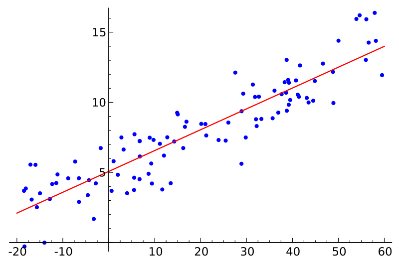
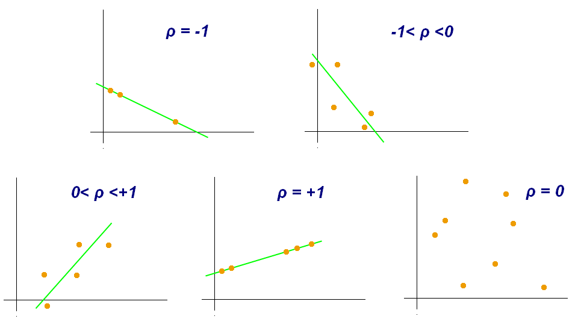

# What is ρ in the Bivariate Normal distribution?

In going from the the Normal distributions for the horizontal axis, $\mathcal{N}(\mu_h,\,\sigma_h^2)$, and vertical axis, $\mathcal{N}(\mu_v,\,\sigma_v^2)$ a new equation was postulated with a parameter $\rho$.  
  

    $f(h,v; \mu_h, \mu_v, \sigma_h, \sigma_v, \rho) =       \frac{1}{2 \pi  \sigma_h \sigma_v \sqrt{1-\rho^2}}       \exp\left(         -\frac{1}{2(1-\rho^2)}\left[           \frac{(h-\mu_h)^2}{\sigma_h^2} +           \frac{(v-\mu_v)^2}{\sigma_v^2} -           \frac{2\rho(h-\mu_h)(v-\mu_v)}{\sigma_h \sigma_v}         \right]       \right)$

First a bit of explanation about what $\rho$ is. Assuming that two variables are correlated, a simple correlation to propose is that the two variables are linearly correlated. Thus for some point $i$ the equation of interest is:  

$$
v_i = v_0 + b h_i + \epsilon_i
$$

Where $v_0$ is the intercept along the vertical axis, $b$ is the slope of the line, and $\epsilon_i$ is the error in the $i$^th^ measurement. Rearranging the equation for $\epsilon_i$:  

$$
\epsilon_i = v_i - v_0 - b h_i
$$

Given the locations $(h_i, v_i)$ of the shots in the group on the target, the coefficients $v_0$ and $b$ are calculated to give a "best" fit to the data. The "best" fit is deemed to be when the sum of the squares of the errors (SSE) is minimized. 

$$
SSE = \sum_{i=1}^n \epsilon_i^2 = \sum_{i=1}^n \lbrace v_i - v_0 - b h_i \rbrace^2
$$

There are two examples of best fits lines shown below. The graph on the right shows the "residuals" from the fit line as vertical line segments from the horizontal value which is assumed to be absolutely accurate to the vertical value which is assumed to contain the error. Values above the line are positive and values below the line are negative.  

With the "best line" fit, then the correlation coefficient $\rho$ is given by the equation:  

    $\rho = \rho_{hv} =\frac{\sum ^n _{i=1}(h_i - \bar{h})(v_i - \bar{v})}{\sqrt{\sum ^n _{i=1}(h_i - \bar{h})^2} \sqrt{\sum ^n _{i=1}(v_i - \bar{v})^2}}$  where $-1 \leq \rho \leq 1$

> !!! warning
    ** !! CAREFUL !! **[Correlation does not prove causation](http://en.wikipedia.org/wiki/Correlation_does_not_imply_causation)

The figure below shows some examples of the correlation coefficients for data fit to lines. The sign of $\rho$ is from the slope of the line. In terms of the absolute value of $\rho$, $\mid \rho \mid = 0$ means that there is no correlation (i.e. the points are totally random) to $\mid \rho \mid = 1$ which means that the is perfect correlation (i.e. all points are exactly on the line). 

> !!! warning
    **!! CAREFUL !!** Blithely accepting the correlation coefficient as gospel is foolish. The residuals should be eyeballed in an effort to determine if there is some problem in the fitting.  

 
The four sets of points, [Anscombe's quartet](http://en.wikipedia.org/wiki/Anscombe%27s_quartet), have the same fit line and the same correlation coefficient.
|}

Thus imagine an elliptical shot pattern, with a lot of shots to reduce noise, being rotated about its COI. Then $\rho = 0$ when the major axis of the ellipse is along the horizontal or vertical axis. The maximum value of $\rho$ would when the major axis of the ellipse was along the one of the two (negative and positive slope) 45 degree lines bisecting the horizontal and vertical axes.  

> !!! warning
    For any sample of shots, if there is a linear relationship between the horizontal and vertical positions of a shot, then the point $(\mu_h, \mu_v)$ would be on the line. Thus with the axes translated to $(\mu_h, \mu_v)$ $b$ would not only be the slope of the line, but it would also be a proportionality constant. 

$$
b = \frac{(v-\mu_v)}{(h-\mu_h)}
$$
