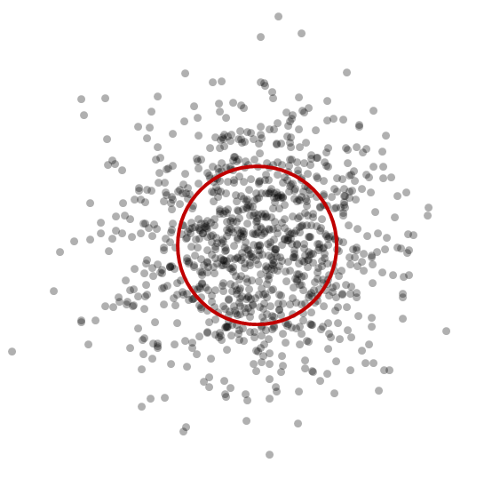

# Why BPC

## The Pursuit of Accuracy (or *Precision*[^1])
***Accuracy:*** Most shooters and manufacturers care about it, but they don't have a proper way to evaluate or describe it.

Present customs are to make unqualified references to "MOA" performance and group size.  Manufacturers give ["MOA" guarantees](closed-form-precision.md#the-3-shot-group), and shooters show off small shot groups, but neither of those are particularly meaningful.  They don't inform essential questions like:

1. Is my gun holding me back in competition?
1. Are my gun and ammo accurate enough to take a particular shot on an animal?
1. Does my gun even have the capability to hit a given target with a high probability?

[BPC™](ballistic-precision-classification.md) provides an efficient and standardized system for characterizing and talking about ballistic accuracy.

What follows is an exposition of current customs and their shortcoming, which are mitigated by the [Ballistic Precision Classification](ballistic-precision-classification.md)™ system.

## The Problem
*It's easy to fool yourself with Extreme Spread, and it’s even easier to fool others.*

First note that even the most precise rail gun will occasionally print a "[flier](fliers.md)."  If 99 out of 100 shots nestle into a dime group, but one breaks away by an inch, would you characterize the precision of that gun as shooting one-inch groups?

Now pick up a rifle, pop in a beta mag, and empty it from the hip.  There’s a chance that 3 of those shots will be touching at 100 yards.  Would you cut out those three shots and declare that you have a half-MOA gun?

Maybe your manufacturer gave you a "1-MOA guarantee," by which they mean that your gun will shoot a 3-shot group into 1” at 100 yards with quality ammo.  So you hit the range, tighten your scope, and fire three shots at the same point.  Bingo: You don’t need calipers to see that they’re within an inch of each other.  You’ve really got a sub-MOA rifle!

Well you’ve got a full box of ammo, so why not knock the center out of that pretty little group?  You take another shot and, damnit, it goes wide.  (You’ll have to crop that group pretty tightly to show it off now!)  But everyone knows you can call fliers, so you take a breath and try some more.  Before you’re through the box you will notice something annoying: *The more shots you take, the wider your group tends to get.*

Now something doesn’t add up here.  The manufacturer guaranteed your rifle would shoot three shots within 1 MOA.  But neither they, nor you, nor your gun could predict which order the shots in that group would appear.  If your gun is really sub-MOA you should be able to pick *any three* as your "group" and it should measure under 1 MOA.  You’ve just discovered one of the industry’s inside jokes: Accuracy guarantees expressed in terms of group sizes are either impossible or meaningless.

You’ve also discovered one of the problems with the Extreme Spread: It depends on the number of shots you take.  Worse yet, it doesn’t differentiate between a target where most of the shots are in a tight group and there’s a lone "flier," and one with the same extreme spread but with every shot scattered about the same distance from the center.

If you kept your sight zeroed and marked every shot taken with a given rifle and lot of ammunition, after 1000 shots[^2] your aggregated target would look something like this: 

{ .figure-caption }
*1000 shot simulation.  Dots represent the center of each hit, not the size of the holes cut by the bullets.*

It doesn’t matter how accurate or inaccurate your gun: its shot distribution is the same as the one that produced this picture.  The only thing that varies with accuracy is how large or small this cluster is.[^3]

What does this mean for accuracy?  You don’t get to pick the order in which those shots are fired.  Any individual shot is essentially selected at random from that distribution of shots.[^4]  If you pick 3 shots at random from that distribution you could end up with three holes practically touching.  They might be near the center of impact, or they might be far away.  Conversely, you could end up with three shots quite far from each other.  Three shots don’t tell you very much!

## The Solution
Fortunately, there are statistically rigorous ways of sampling and describing the accuracy of a gun.  And a shooter doesn't have to understand the statistics to understand what those statistics imply for performance.

The [Ballistic Precision Classification](ballistic-precision-classification.md) (BPC™) system allows anyone – a shooter or a manufacturer – to determine how accurate a gun is using a single number.  And that number lets you derive all sorts of useful and statistically meaningful information.  For example:

- What proportion of shots will hit within a 1MOA circle?  How about a half MOA?
- How many 3- or 5-shot groups should measure under an inch at 100 yards?

The [Ballistic Precision Classification](ballistic-precision-classification.md) white paper explains exactly how BPC works. It provides a step-by-step guide to what information you need and how to actually calculate BPC. Everything can be done in a simple spreadsheet.

For the curious who want to read up on the statistical model that BPC uses for making inferences on expected future performance of a gun, the white paper links to pages on Ballistipedia that provide all background information. Every formula is laid out and backed up with relevant literature sources. However, these technical details are not required to simply use BPC for your own purposes. You can enjoy driving a car without being an engineer, and you can benefit from BPC without being a statistician.

## Notes

[^1]: Most of the time, when people talk about "accuracy" they're actually talking about "precision."

[^2]: This is at a "point-blank" target, by which we mean one that is close enough that wind variation and muzzle velocity variation are insignificant.  For high-velocity bullets these conditions hold out to at least 100 yards.  For subsonic bullets they are valid to at least 25 yards.

[^3]: The red circle is drawn around the center of the distribution and contains exactly half of the shots in the picture.  The radius of that red circle is called the [Circular Error Probable (CEP)](describing-precision.md#circular-error-probable-cep), and that single value is sufficient to characterize the accuracy of a gun.  Some real-world CEP values:

* The U.S. Precision Sniper Rifle contract called for CEP better than 0.3MOA
* The M24 and M110 acceptance standards require CEP better than 0.6MOA
* XM193 ammunition from a test barrel has to shoot tighter than 0.7MOA CEP
I.e., from a fixed barrel XM193 ammunition should put at least half its shots inside a 1.5” diameter circle at 100 yards.

[^4]: Possible exceptions are "fouler" and "cold-bore" shots, or shots on an overheated barrel.
